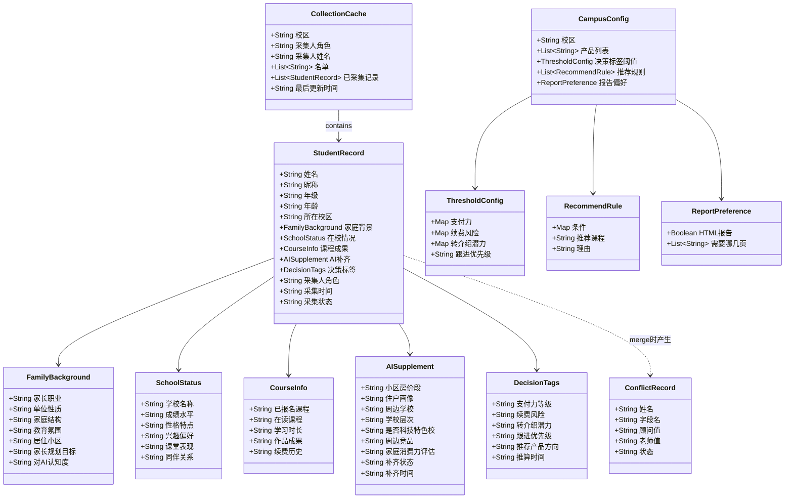
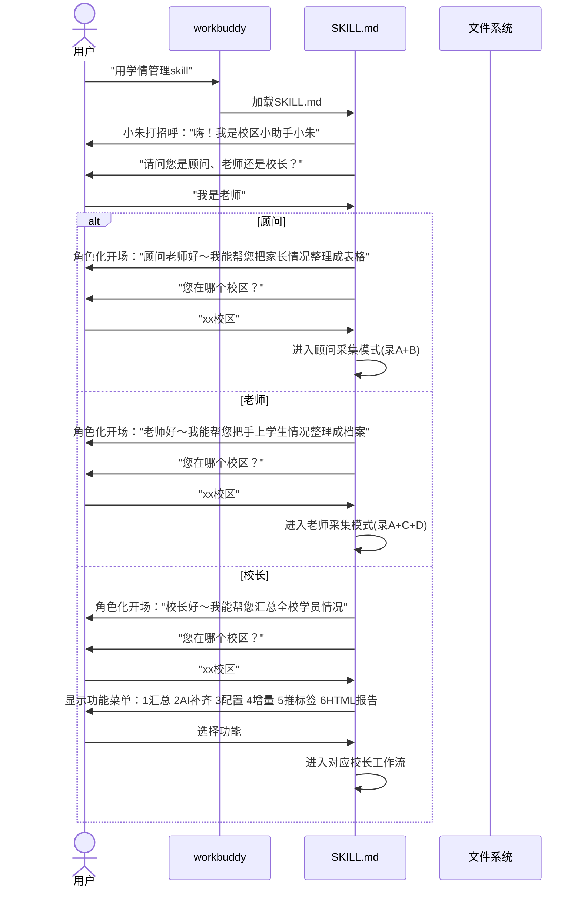
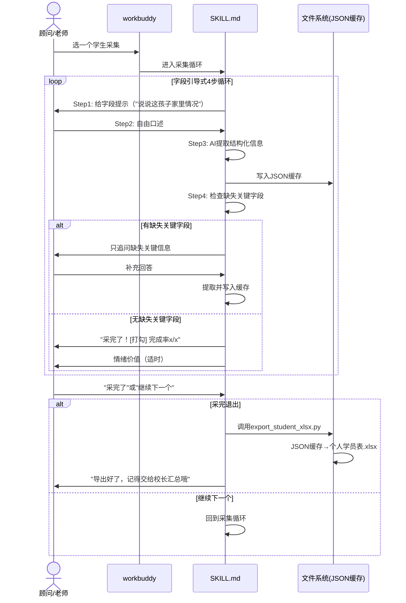
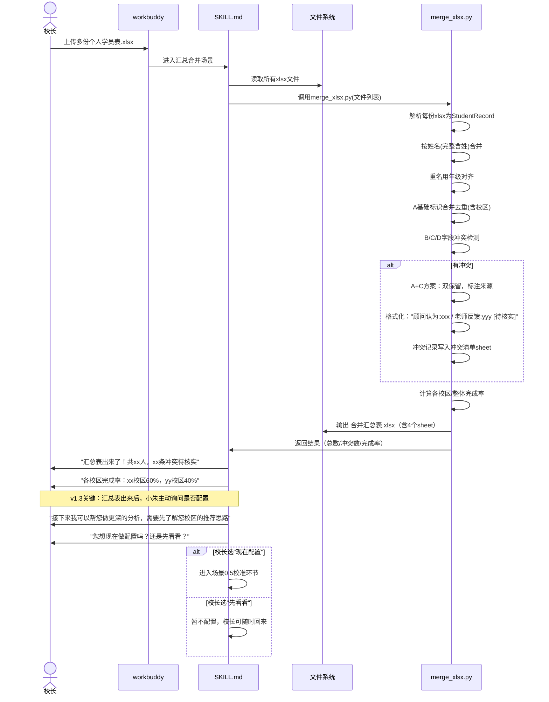
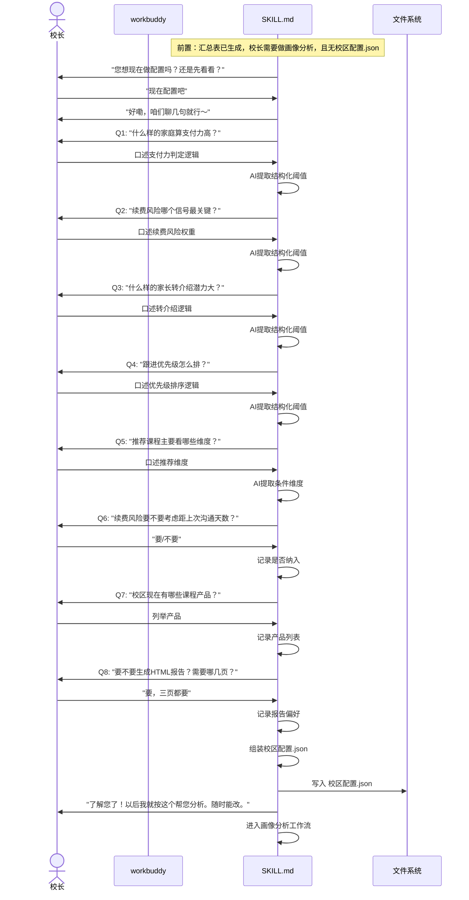
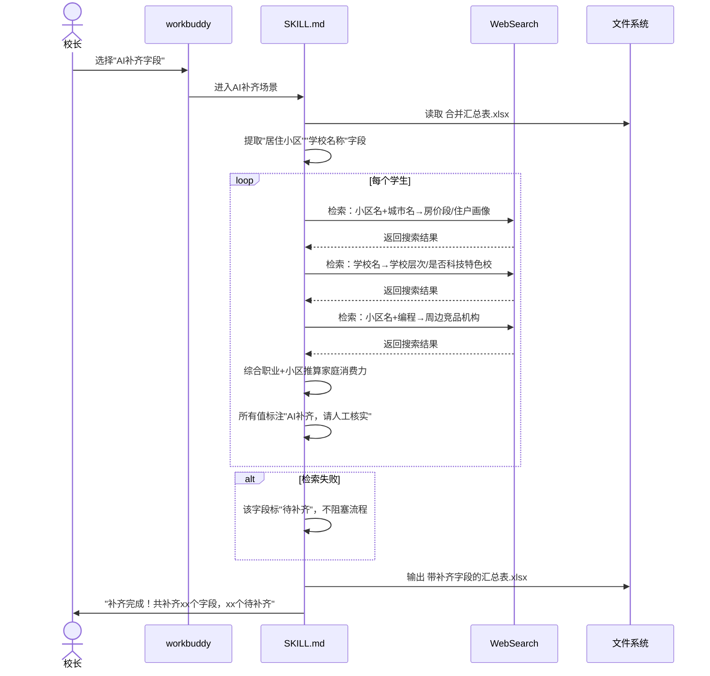
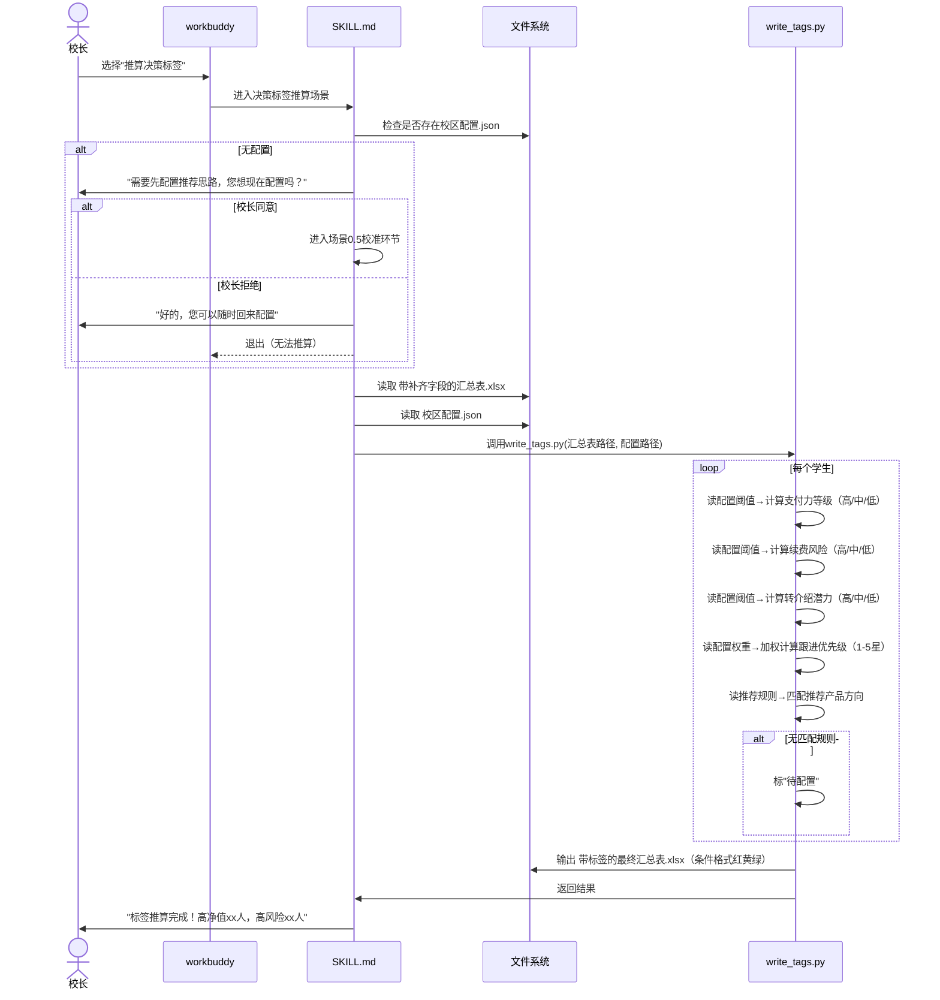
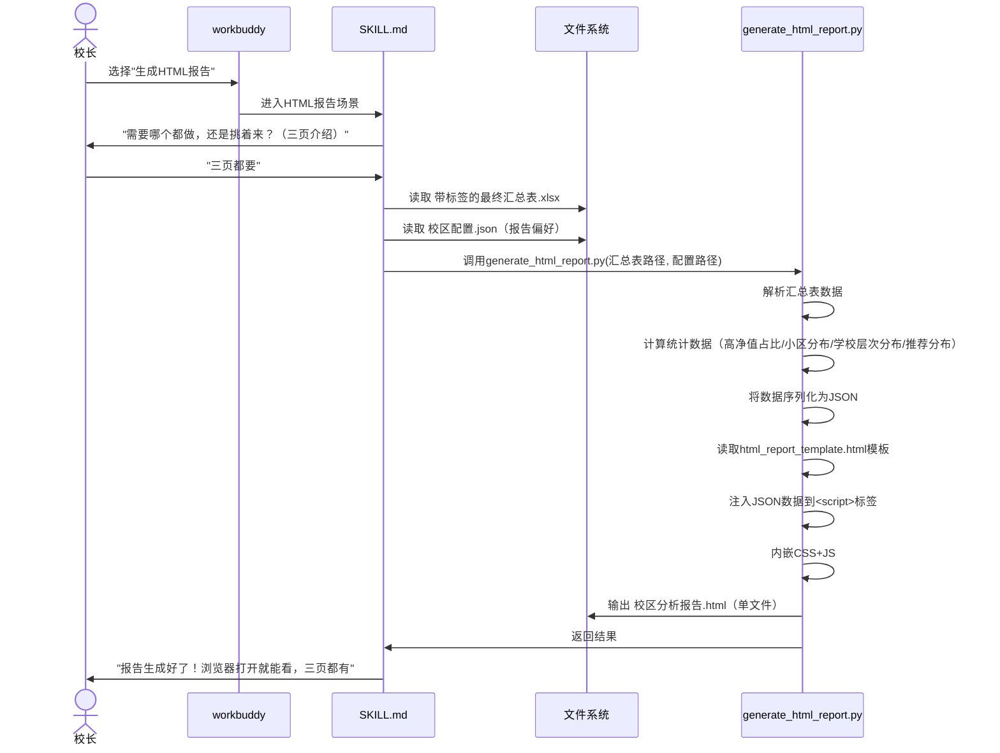
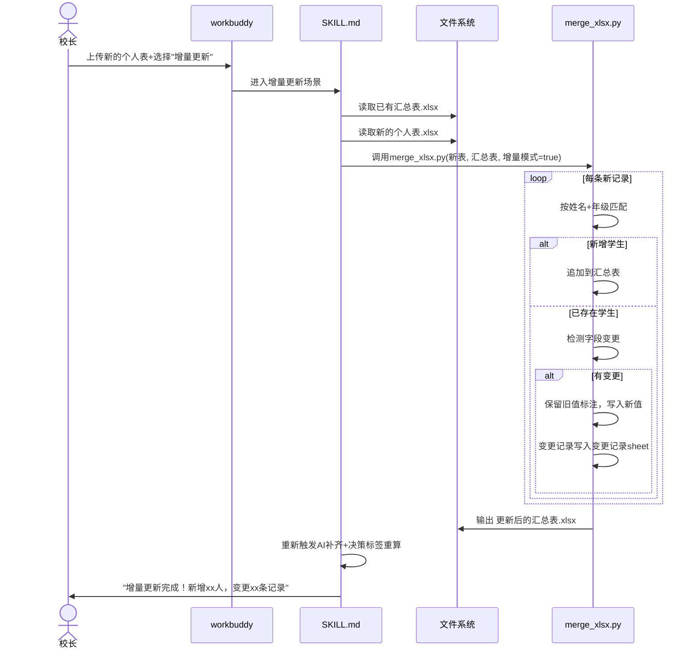
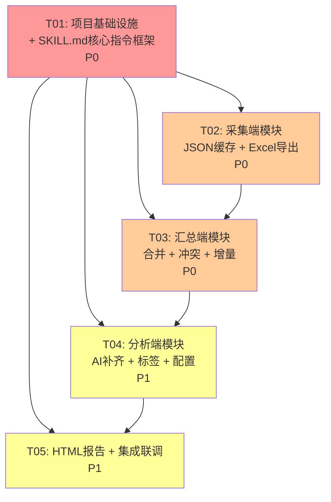

# 校区学员情况管理 Skill — 架构设计方案

| 项 | 内容 |
|---|---|
| 文档版本 | v1.0 |
| 撰写人 | 架构师 高见远（Gao） |
| 日期 | 2026-06-22 |
| 输入 | PRD v1.3 |
| 产品形态 | workbuddy Skill（以 SKILL.md 为载体） |
| 技术栈 | SKILL.md（Markdown指令） + Python脚本（openpyxl处理Excel） + 单HTML文件（内嵌CSS/JS） |

---

## 目录

- [Part A: System Design](#part-a-system-design)
  - [1. 实现方案](#1-实现方案)
  - [2. 文件列表及仓库结构](#2-文件列表及仓库结构)
  - [3. 数据结构和接口](#3-数据结构和接口)
  - [4. 程序调用流程（时序图）](#4-程序调用流程时序图)
  - [5. 待明确事项](#5-待明确事项)
- [Part B: Task Decomposition](#part-b-task-decomposition)
  - [6. 依赖包列表](#6-依赖包列表)
  - [7. 任务列表（有序，含依赖）](#7-任务列表有序含依赖)
  - [8. 共享知识（跨文件约定）](#8-共享知识跨文件约定)
  - [9. 任务依赖图](#9-任务依赖图)

---

# Part A: System Design

## 1. 实现方案

### 1.1 核心技术挑战

| 挑战 | 难点 | 解决方案 |
|---|---|---|
| **SKILL.md 是"指令"非"代码"** | workbuddy 加载 SKILL.md 后按其指引工作，不是传统编程，需要用自然语言+结构化Markdown精确描述AI行为 | 用Markdown章节结构编排，每个场景给出"触发→输入→处理→输出"四要素，话术用参考非脚本，字段引导式采集用"给提示→提取→检查→追问"四步循环 |
| **字段引导式采集** | 不是传统表单逐字段填写，是AI驱动的对话流：给字段提示→顾问讲→AI提取结构化→检查缺失→只追问缺失关键信息 | SKILL.md中定义字段引导式采集循环（4步），附带字段定义表和话术参考模板，让workbuddy按循环执行 |
| **三层字段架构** | 人工录入层（A/B/C/D）+ AI补齐层（联网检索）+ AI推算层（决策标签），三层有依赖关系 | SKILL.md中按场景分段：采集场景只管第一层，AI补齐场景管第二层，决策标签场景管第三层（读校区配置.json阈值） |
| **Excel读写** | 采集端JSON缓存→导出xlsx；汇总端读多份xlsx→合并→输出xlsx；用户只接触xlsx不接触json | Python脚本 + openpyxl：采集导出脚本、汇总合并脚本、标签写入脚本分开 |
| **冲突信息A+C双保留** | 同字段不同来源都保留，标注来源+flag | 汇总合并时，冲突字段单格内写 `"顾问认为:xxx / 老师反馈:yyy [待核实]"`，冲突清单单独sheet |
| **HTML单文件报告** | 三页结构，浏览器直接打开，无外部依赖 | 单HTML文件，内嵌CSS+JS，数据以JSON内嵌在`<script>`标签中，Chart.js走CDN（或纯CSS图表降级） |
| **校准环节触发逻辑** | 不是首次打开触发，是汇总表出来后、需要做画像分析时触发 | SKILL.md场景6决策标签推算前置检查：无校区配置.json→小朱主动询问是否校准→校准生成配置→再推算 |
| **多校区贯穿** | 校区字段在采集/汇总/分析全流程贯穿 | 采集时确认校区写入JSON缓存，汇总时校区列保留，分析时按校区分组 |

### 1.2 框架与库选择

| 组件 | 选择 | 理由 |
|---|---|---|
| Skill载体 | SKILL.md（Markdown） | workbuddy原生，AI直接加载执行 |
| 内部缓存 | JSON（本地文件） | 轻量、人类可读、workbuddy可直接读写 |
| Excel处理 | Python + openpyxl | 成熟稳定、支持样式/合并单元格/条件格式、workbuddy可执行Python脚本 |
| HTML报告 | 单HTML文件 + 内嵌CSS/JS | 浏览器直接打开、无构建步骤、可离线 |
| 图表（可选） | Chart.js CDN 或 纯CSS | CDN版本功能丰富；纯CSS降级版无外部依赖 |
| 联网检索 | workbuddy内置WebSearch | AI补齐层，灵活检索不写死规则 |

### 1.3 架构模式

本项目不是传统Web应用，而是**指令驱动架构（Instruction-Driven Architecture）**：

```
┌─────────────────────────────────────────────────┐
│                 workbuddy 平台                    │
│                                                   │
│  ┌─────────────┐    加载     ┌──────────────┐   │
│  │  用户对话    │ ─────────→ │   SKILL.md    │   │
│  └─────────────┘            │ (指令编排核心) │   │
│         │                    └──────┬───────┘   │
│         │                           │ 调用       │
│         ▼                           ▼            │
│  ┌─────────────┐  读写     ┌──────────────┐    │
│  │  Excel文件   │ ←──────→ │ Python脚本    │    │
│  │  JSON缓存    │          │ (openpyxl)    │    │
│  │  HTML报告    │          └──────────────┘    │
│  └─────────────┘                               │
│         │                           │            │
│         │           WebSearch        │            │
│         └───────────────────────────┘            │
└─────────────────────────────────────────────────┘
```

**核心设计**：SKILL.md 是唯一编排入口，它定义了 workbuddy 在什么场景下做什么、调用什么脚本、读写什么文件。Python脚本是被SKILL.md调用的工具函数。

### 1.4 SKILL.md 章节结构设计

SKILL.md 是 workbuddy 加载执行的指令文件，其章节结构直接决定AI行为。以下是完整章节设计：

```
SKILL.md
├── §0  元信息（Skill名称、版本、触发关键词、描述）
├── §1  触发条件（用户说什么时激活本Skill）
├── §2  人格化角色定义（校区小助手小朱）
│   ├── 2.1 角色设定（名字、身份、语气风格）
│   ├── 2.2 自称规则（全程自称"小朱"）
│   └── 2.3 情绪价值原则（适时点出AI价值，不用每个都教育）
├── §3  角色路由逻辑
│   ├── 3.1 启动流程（打招呼→确认身份→角色化开场→确认校区→进入模式）
│   ├── 3.2 顾问模式（录A+B字段，采集工作流）
│   ├── 3.3 老师模式（录A+C+D字段，采集工作流+名单管理）
│   ├── 3.4 校长模式（汇总工作流，含6个子功能菜单）
│   └── 3.5 多校区处理（首次确认校区，后续默认带入）
├── §4  字段定义（三层架构）
│   ├── 4.1 第一层：人工录入层（A基础标识/B家庭背景/C在校情况/D课程成果）
│   │   ├── 每个字段的名称、类型、必填、录入角色
│   │   └── 字段引导式采集四步循环说明
│   ├── 4.2 第二层：AI补齐层（联网检索字段+标注规则）
│   │   ├── 补齐字段清单（小区房价/周边学校/竞品/学校层次+科技特色）
│   │   ├── 联网搜索指引（方向性，非死规则）
│   │   └── 降级策略（检索失败标"待补齐"，不阻塞）
│   └── 4.3 第三层：AI推算层（5个决策标签+推算逻辑）
│       ├── 支付力/续费风险/转介绍潜力/跟进优先级（从校区配置.json读阈值）
│       └── 推荐产品方向（从校区配置.json读推荐规则匹配）
├── §5  采集话术模板（参考非脚本）
│   ├── 5.1 各字段组引导话术（A/B/C/D）
│   ├── 5.2 通用话术模板（开始/答不知道/采完一人/全部采完）
│   └── 5.3 追问颗粒度规则（只追问缺失关键信息，不为追问而追问）
├── §6  8个场景流程定义
│   ├── 场景0：人格化启动（触发/输入/处理/输出）
│   ├── 场景0.5：校长配置流程-校准环节（触发：汇总表后需画像分析且无配置）
│   ├── 场景1：学员信息采集-字段引导式（4步循环）
│   ├── 场景2：分批交付+完成率显示
│   ├── 场景3：表格汇总合并（冲突A+C方案）
│   ├── 场景4：AI补齐字段（联网检索）
│   ├── 场景5：推荐规则配置（引导式）
│   ├── 场景6：决策标签推算（前置：无配置先触发校准）
│   ├── 场景7：HTML前端报告（可选，三页结构）
│   └── 场景8：增量更新
├── §7  输出格式规范
│   ├── 7.1 个人学员表.xlsx结构（采集端，顾问版/老师版）
│   ├── 7.2 合并汇总表.xlsx结构（含冲突sheet、变更记录sheet）
│   ├── 7.3 带补齐字段汇总表.xlsx结构
│   ├── 7.4 带标签最终汇总表.xlsx结构（决策标签列+条件格式）
│   ├── 7.5 校区分析报告.html结构（三页，单文件）
│   └── 7.6 校区配置.json结构（决策标签阈值+推荐规则+报告偏好）
├── §8  Python脚本调用指引
│   ├── 8.1 脚本清单（导出xlsx/合并xlsx/写标签/生成HTML）
│   ├── 8.2 调用方式（workbuddy执行Python脚本，传入参数）
│   └── 8.3 输入输出约定（脚本参数格式、输出文件路径）
├── §9  开源发布规范
│   ├── 9.1 仓库结构
│   ├── 9.2 示例配置要求（化名数据）
│   └── 9.3 MIT协议
└── §10 注意事项与约束
    ├── 用户不接触JSON
    ├── 姓名完整含姓，重名用年级对齐
    ├── 容忍"不知道"
    ├── 联网检索方式灵活不写死
    └── 先体验价值再深入配置
```

### 1.5 字段引导式采集的实现机制

这是PRD的核心交互模式，SKILL.md中需明确定义4步循环：

```
┌──────────────────────────────────────────────────────┐
│              字段引导式采集 4 步循环                    │
│                                                        │
│  Step 1: 给字段提示                                    │
│  小朱给出字段组的引导提示（如"说说这孩子家里情况"）      │
│  ↓                                                     │
│  Step 2: 顾问/老师自由讲                               │
│  用户按提示自然语言口述，想到啥说啥                     │
│  ↓                                                     │
│  Step 3: AI提取结构化                                  │
│  workbuddy从口述中提取对应字段值，填入JSON缓存          │
│  ↓                                                     │
│  Step 4: 检查缺失→只追问关键                           │
│  检查哪些关键字段还缺失→只追问缺失的关键信息            │
│  （知道小区就不追问自住/租房，太私密且价值低）          │
│  ↓                                                     │
│  循环至该生所有字段组采完→打勾→情绪价值→下一个          │
└──────────────────────────────────────────────────────┘
```

SKILL.md中此部分的关键写法：
- 用自然语言描述4步循环，让workbuddy理解执行逻辑
- 附字段定义表（字段名、类型、必填、录入角色），让workbuddy知道提取什么
- 附话术参考模板（非脚本），让workbuddy知道怎么引导
- 附追问颗粒度规则，让workbuddy知道什么该追什么不该追

---

## 2. 文件列表及仓库结构

### 2.1 完整仓库结构

```
campus-student-skill/
├── SKILL.md                              # Skill主体（workbuddy加载执行的指令）
├── README.md                             # 项目说明（面向校长/技术人员）
├── LICENSE                               # MIT协议
├── ARCHITECTURE.md                       # 本架构文档
│
├── scripts/                              # Python脚本（被SKILL.md调用）
│   ├── export_student_xlsx.py            # 采集端：JSON缓存→导出个人学员表.xlsx
│   ├── merge_xlsx.py                     # 汇总端：读多份xlsx→合并→输出汇总表.xlsx
│   ├── write_tags.py                     # 决策标签写入汇总表（从校区配置.json读阈值）
│   ├── generate_html_report.py           # 生成HTML单文件报告（三页结构）
│   └── utils.py                          # 公共工具函数（字段映射、冲突格式化等）
│
├── templates/                            # 模板文件
│   ├── student_template.json             # 学员档案JSON模板（采集端缓存结构）
│   ├── campus_config_template.json       # 校区配置JSON模板（校准环节生成）
│   └── html_report_template.html         # HTML报告模板（三页骨架）
│
├── 示例配置/                              # 开箱即用的样例（化名数据）
│   ├── 校区配置_示例.json
│   ├── 个人学员表_顾问_示例.xlsx
│   ├── 个人学员表_老师_示例.xlsx
│   ├── 合并汇总表_示例.xlsx
│   └── 校区分析报告_示例.html
│
└── docs/                                  # 文档
    ├── 字段说明.md                        # v0.4字段字典
    ├── 话术设计说明.md                    # 采集话术设计说明
    ├── sequence-diagram.mermaid           # 时序图
    └── class-diagram.mermaid              # 类图
```

### 2.2 文件职责说明

| 文件 | 职责 | 谁写/谁改 |
|---|---|---|
| SKILL.md | Skill主体，workbuddy加载执行的指令编排 | 工程师编写，架构师审核 |
| README.md | 项目说明，教人怎么用（安装/使用/FAQ） | 工程师编写 |
| LICENSE | MIT开源协议 | 直接用MIT模板 |
| scripts/export_student_xlsx.py | 读取采集端JSON缓存→生成个人学员表.xlsx | 工程师编写 |
| scripts/merge_xlsx.py | 读取多份个人学员表.xlsx→按姓名合并→输出汇总表.xlsx（含冲突处理） | 工程师编写 |
| scripts/write_tags.py | 读取汇总表+校区配置.json→计算决策标签→写入汇总表 | 工程师编写 |
| scripts/generate_html_report.py | 读取带标签汇总表→生成三页HTML单文件报告 | 工程师编写 |
| scripts/utils.py | 公共工具：字段映射、冲突格式化、日期处理等 | 工程师编写 |
| templates/student_template.json | 学员档案JSON结构模板 | 工程师编写 |
| templates/campus_config_template.json | 校区配置JSON结构模板 | 工程师编写 |
| templates/html_report_template.html | HTML报告三页骨架模板 | 工程师编写 |
| 示例配置/* | 化名样例数据，开箱即用 | 工程师编写 |
| docs/字段说明.md | 字段字典（v0.4字段框架） | 从PRD提取 |
| docs/话术设计说明.md | 采集话术设计说明 | 从PRD提取 |

---

## 3. 数据结构和接口

### 3.1 类图（Mermaid classDiagram）



### 3.2 学员档案 JSON Schema（采集端缓存）

采集端本地缓存，用户不可见。每个采集人（顾问/老师）一份。

```json
{
  "$schema": "collection_cache_v1",
  "校区": "示例校区",
  "采集人角色": "老师",
  "采集人姓名": "王老师",
  "名单": ["张小明", "李小红", "王小刚", "赵小华", "钱小亮"],
  "已采集记录": [
    {
      "姓名": "张小明",
      "昵称": "小明",
      "年级": "4年级",
      "年龄": "10",
      "所在校区": "示例校区",
      "家庭背景": {
        "家长职业": "",
        "单位性质": "",
        "家庭结构": "",
        "教育氛围": "",
        "居住小区": "",
        "家长规划目标": "",
        "对AI认知度": ""
      },
      "在校情况": {
        "学校名称": "示范小学",
        "成绩水平": "中等偏上",
        "性格特点": "活泼",
        "兴趣偏好": "乐高、编程",
        "课堂表现": "专注",
        "同伴关系": "良好"
      },
      "课程成果": {
        "已报名课程": "Scratch基础",
        "在读课程": "Python入门",
        "学习时长": "8个月",
        "作品成果": "做过2个小游戏",
        "续费历史": "续费1次"
      },
      "AI补齐": null,
      "决策标签": null,
      "采集人角色": "老师",
      "采集时间": "2026-06-22T10:30:00",
      "采集状态": "已采"
    }
  ],
  "最后更新时间": "2026-06-22T10:30:00"
}
```

> **说明**：顾问采集时，`家庭背景`有值、`在校情况`和`课程成果`为空；老师采集时，`在校情况`和`课程成果`有值、`家庭背景`为空。合并时按姓名+年级对齐。

### 3.3 校区配置.json Schema（含决策标签阈值+推荐规则+报告偏好）

校准环节由小朱问校长后生成，决策标签推算时读取。

```json
{
  "$schema": "campus_config_v1",
  "校区": "示例校区",
  "产品列表": ["AI编程进阶营", "Scratch基础", "竞赛冲刺班"],
  "决策标签阈值": {
    "支付力": {
      "高": "居住高端小区 或 家长体制内/高薪职业",
      "中": "居住普通商品房小区 或 家长普通收入",
      "低": "居住回迁房/老小区 或 家长收入不稳定"
    },
    "续费风险": {
      "高": "学习时长<3个月 且 课堂表现下滑 且 续费历史0次",
      "中": "学习时长3-6个月 或 课堂表现一般",
      "低": "学习时长>6个月 且 课堂表现稳定 且 已续费1次以上"
    },
    "转介绍潜力": {
      "高": "家庭结构三代同堂 且 家长规划目标明确 且 对AI认知度高",
      "中": "满足两项",
      "低": "满足一项或以下"
    },
    "跟进优先级": "支付力权重0.4 + 续费风险权重0.3 + 转介绍潜力权重0.3，加权排序分5档"
  },
  "推荐规则": [
    {
      "条件": {
        "支付力": "高",
        "年级": "4-6年级",
        "兴趣": "含科技类",
        "学校科技特色": true
      },
      "推荐课程": "AI编程进阶营",
      "理由": "高支付力+科技兴趣+科技特色校，适合进阶产品"
    },
    {
      "条件": {
        "支付力": "中",
        "年级": "1-3年级",
        "兴趣": "含科技类"
      },
      "推荐课程": "Scratch基础",
      "理由": "中等支付力+低年级+科技兴趣，适合入门产品"
    }
  ],
  "报告偏好": {
    "HTML报告": true,
    "需要哪几页": ["页1表格呈现", "页2校区分析", "页3产品推荐"]
  }
}
```

### 3.4 汇总表 Excel 结构定义

#### Sheet1: 学员汇总（主表）

| 列序 | 列名 | 来源 | 说明 |
|---|---|---|---|
| A | 校区 | A基础标识 | 多校区区分 |
| B | 姓名 | A基础标识 | 完整含姓 |
| C | 年级 | A基础标识 | 重名对齐依据 |
| D | 年龄 | A基础标识 | |
| E | 家长职业 | B家庭背景 | 顾问录 |
| F | 单位性质 | B家庭背景 | 顾问录 |
| G | 家庭结构 | B家庭背景 | 顾问录 |
| H | 教育氛围 | B家庭背景 | 顾问录 |
| I | 居住小区 | B家庭背景 | 顾问录 |
| J | 家长规划目标 | B家庭背景 | 顾问录 |
| K | 对AI认知度 | B家庭背景 | 顾问录 |
| L | 学校名称 | C在校情况 | 老师录 |
| M | 成绩水平 | C在校情况 | 老师录 |
| N | 性格特点 | C在校情况 | 老师录 |
| O | 兴趣偏好 | C在校情况 | 老师录 |
| P | 课堂表现 | C在校情况 | 老师录 |
| Q | 同伴关系 | C在校情况 | 老师录 |
| R | 已报名课程 | D课程成果 | 老师录 |
| S | 在读课程 | D课程成果 | 老师录 |
| T | 学习时长 | D课程成果 | 老师录 |
| U | 作品成果 | D课程成果 | 老师录 |
| V | 续费历史 | D课程成果 | 老师录 |
| W | 冲突标注 | 合并时生成 | 有冲突的行标注 |
| X | 学校层次(科技特色) | AI补齐 | "普通校(非科技特色)(AI补齐,请核实)" |
| Y | 小区房价段 | AI补齐 | "8-10万/㎡(AI补齐,请核实)" |
| Z | 住户画像 | AI补齐 | |
| AA | 周边竞品 | AI补齐 | |
| AB | 家庭消费力 | AI补齐 | 综合职业+小区推算 |
| AC | 支付力 | 决策标签 | 高/中/低，条件格式红黄绿 |
| AD | 续费风险 | 决策标签 | 高/中/低，条件格式 |
| AE | 转介绍潜力 | 决策标签 | 高/中/低，条件格式 |
| AF | 跟进优先级 | 决策标签 | ⭐⭐⭐⭐⭐（1-5星） |
| AG | 推荐产品方向 | 决策标签 | 课程名，无匹配标"待配置" |

#### Sheet2: 冲突清单

| 列名 | 说明 |
|---|---|
| 姓名 | 冲突学生姓名 |
| 年级 | 用于对齐 |
| 字段名 | 冲突字段 |
| 顾问值 | 顾问录入的值 |
| 老师值 | 老师录入的值 |
| 状态 | 待核实/已核实 |
| 备注 | 校长核实后填写 |

#### Sheet3: 变更记录（增量更新时）

| 列名 | 说明 |
|---|---|
| 姓名 | 变更学生 |
| 变更时间 | ISO 8601 |
| 变更字段 | 改了什么 |
| 旧值 | 原来的值 |
| 新值 | 新的值 |
| 变更来源 | 哪份新表带来的变更 |

#### Sheet4: 采集完成率

| 列名 | 说明 |
|---|---|
| 校区 | 校区名 |
| 采集人 | 顾问/老师姓名 |
| 角色 | 顾问/老师 |
| 名单总数 | 待采总数 |
| 已采数 | 已采集数 |
| 完成率 | 百分比 |

### 3.5 冲突信息存储格式

合并时同字段不同来源的冲突处理（A+C双保留方案）：

**Excel单元格内格式**：
```
顾问认为:xxx / 老师反馈:yyy [待核实]
```

**JSON内部格式**（合并中间态）：
```json
{
  "姓名": "张小明",
  "字段": "课堂表现",
  "冲突": true,
  "值": [
    {"来源": "顾问", "角色": "顾问", "值": "专注"},
    {"来源": "老师", "角色": "老师", "值": "容易走神"}
  ],
  "状态": "待核实"
}
```

### 3.6 HTML报告数据注入格式

HTML报告是单文件，数据以JSON内嵌在 `<script>` 标签中：

```html
<script>
  const REPORT_DATA = {
    "生成时间": "2026-06-22T14:00:00",
    "校区": "示例校区",
    "学员列表": [
      {
        "姓名": "张小明", "年级": "4年级", "校区": "示例校区",
        "支付力": "高", "续费风险": "低", "转介绍潜力": "高",
        "跟进优先级": 4, "推荐方向": "AI编程进阶营",
        "居住小区": "示范小区", "学校层次": "普通校(非科技特色)"
      }
    ],
    "统计": {
      "总人数": 50,
      "高净值占比": "30%",
      "续费高风险占比": "15%",
      "高转介绍潜力占比": "25%",
      "家长来源小区分布": [{"小区": "示范小区", "人数": 12}],
      "学校层次分布": [{"层次": "重点校", "人数": 8}, {"层次": "普通校", "人数": 35}, {"层次": "科技特色校", "人数": 7}],
      "推荐分布": [{"课程": "AI编程进阶营", "人数": 15, "占比": "30%"}]
    }
  };
</script>
```

---

## 4. 程序调用流程（时序图）

### 4.1 三角色路由时序图



### 4.2 场景1：字段引导式采集时序图



### 4.3 场景3：汇总合并时序图



### 4.4 场景0.5+5：校准环节+推荐规则配置时序图



### 4.5 场景4：AI补齐字段时序图



### 4.6 场景6：决策标签推算时序图



### 4.7 场景7：HTML报告生成时序图



### 4.8 场景8：增量更新时序图



---

## 5. 待明确事项

| 编号 | 待明确项 | 当前假设 | 影响范围 |
|---|---|---|---|
| U1 | Python脚本执行方式 | 假设workbuddy可直接执行Python脚本（通过Bash工具）。若workbuddy不支持执行外部脚本，则需将Excel处理逻辑全部用SKILL.md自然语言指令+workbuddy内置能力实现 | scripts/目录全部脚本 |
| U2 | Chart.js CDN可用性 | HTML报告默认用Chart.js CDN做图表。若离线场景需降级为纯CSS图表 | generate_html_report.py、html_report_template.html |
| U3 | 决策标签阈值的自然语言解析 | 校区配置.json中阈值是自然语言描述（如"居住高端小区 或 家长体制内"），workbuddy需理解并执行。假设workbuddy的AI能力足以理解这些自然语言规则 | SKILL.md场景6、write_tags.py |
| U4 | 多人同时采集的并发问题 | 假设同一校区同一角色只有一人同时采集（顾问各采各的、老师各采各的），合并时由校长统一处理。不做实时并发控制 | merge_xlsx.py |
| U5 | 姓名匹配的容错 | 假设姓名匹配为精确匹配（完整含姓）。若存在同音字/别名/昵称匹配需求，需额外设计匹配算法 | merge_xlsx.py |
| U6 | HTML报告的交互复杂度 | 假设页1表格筛选用纯JS实现（不依赖前端框架），足够轻量。若需复杂交互（如拖拽排序、分页），可考虑引入轻量库 | generate_html_report.py |
| U7 | 联网检索的频率限制 | 假设workbuddy内置WebSearch无严格频率限制。若有限制，AI补齐需分批进行或加缓存 | SKILL.md场景4 |

---

# Part B: Task Decomposition

## 6. 依赖包列表

### 6.1 Python依赖（scripts/目录）

```
openpyxl>=3.1.2: Excel读写（.xlsx格式，支持样式/合并单元格/条件格式）
json: 标准库，JSON缓存读写（无需安装）
datetime: 标准库，时间戳处理（无需安装）
pathlib: 标准库，路径处理（无需安装）
```

> **说明**：只需安装openpyxl一个第三方包，其余均为Python标准库。workbuddy执行Python脚本时需确保Python环境已安装openpyxl。

### 6.2 HTML报告依赖

```
Chart.js@4.4.0: 图表库（CDN引入，https://cdn.jsdelivr.net/npm/chart.js）
  - 用于页2校区分析的饼图/柱状图
  - 用于页3产品推荐画像的分布图
  - 离线降级：纯CSS柱状图（不依赖外部库）
```

### 6.3 无需安装的工具

| 工具 | 用途 | 说明 |
|---|---|---|
| workbuddy内置WebSearch | AI补齐层联网检索 | 灵活检索，不写死规则 |
| 浏览器 | 打开HTML报告 | 用户已有 |
| Excel/WPS | 打开xlsx文件 | 用户已有 |

---

## 7. 任务列表（有序，含依赖）

### T01: 项目基础设施 + SKILL.md 核心指令框架

| 项 | 内容 |
|---|---|
| **任务名** | 项目基础设施 + SKILL.md 核心指令框架 |
| **源文件** | SKILL.md, README.md, LICENSE, ARCHITECTURE.md（已存在）, scripts/utils.py, templates/student_template.json, templates/campus_config_template.json |
| **依赖** | 无 |
| **优先级** | P0 |
| **描述** | 搭建项目骨架：①创建完整仓库目录结构 ②编写SKILL.md核心指令框架（§0元信息~§10注意事项，包含触发条件、小朱人格化、角色路由、字段定义三层架构、采集话术模板、8场景流程定义、输出格式规范、脚本调用指引、开源规范、约束清单）③编写README.md（项目背景/安装/使用教程/FAQ）④LICENSE（MIT）⑤scripts/utils.py公共工具函数 ⑥templates/下两个JSON模板 |
| **验收标准** | SKILL.md包含完整章节结构，workbuddy加载后能执行角色路由和字段引导式采集；README.md含安装指引和三角色快速上手；utils.py含字段映射、冲突格式化等基础函数 |

### T02: 采集端模块（JSON缓存 + Excel导出）

| 项 | 内容 |
|---|---|
| **任务名** | 采集端模块：JSON缓存管理 + 个人学员表导出 |
| **源文件** | scripts/export_student_xlsx.py, templates/student_template.json（完善）, 示例配置/个人学员表_顾问_示例.xlsx, 示例配置/个人学员表_老师_示例.xlsx |
| **依赖** | T01 |
| **优先级** | P0 |
| **描述** | 实现采集端核心功能：①export_student_xlsx.py：读取采集端JSON缓存→生成个人学员表.xlsx（顾问版含A+B字段列，老师版含A+C+D字段列），含表头样式、采集完成率sheet ②完善student_template.json：定义采集端缓存完整Schema ③生成化名示例xlsx（顾问版+老师版各一份） |
| **验收标准** | 脚本能正确读取JSON缓存并输出格式正确的xlsx；顾问版只含A+B列，老师版含A+C+D列；示例数据全部化名 |

### T03: 汇总端模块（合并 + 冲突处理 + 增量更新）

| 项 | 内容 |
|---|---|
| **任务名** | 汇总端模块：多表合并 + 冲突A+C方案 + 增量更新 |
| **源文件** | scripts/merge_xlsx.py, 示例配置/合并汇总表_示例.xlsx |
| **依赖** | T01, T02 |
| **优先级** | P0 |
| **描述** | 实现汇总端核心功能：①merge_xlsx.py：读取多份个人学员表.xlsx→按姓名（完整含姓）合并→重名用年级对齐→A基础标识合并去重→B/C/D冲突检测+A+C双保留（"顾问认为:xxx / 老师反馈:yyy [待核实]"）→输出汇总表.xlsx（含4个sheet：学员汇总/冲突清单/变更记录/完成率）②增量更新模式：识别新增学生追加+已存在学生字段变更更新（旧值标注）③生成化名示例汇总表 |
| **验收标准** | 能正确合并多份xlsx；冲突字段正确双保留并标注来源；完成率正确计算；增量更新正确识别新增和变更；示例数据全部化名 |

### T04: 分析端模块（AI补齐 + 决策标签 + 配置生成）

| 项 | 内容 |
|---|---|
| **任务名** | 分析端模块：AI补齐指引 + 决策标签推算 + 校区配置生成 |
| **源文件** | scripts/write_tags.py, templates/campus_config_template.json（完善）, 示例配置/校区配置_示例.json, docs/字段说明.md, docs/话术设计说明.md |
| **依赖** | T01, T03 |
| **优先级** | P1 |
| **描述** | 实现分析端核心功能：①write_tags.py：读取汇总表+校区配置.json→按配置阈值计算5个决策标签（支付力/续费风险/转介绍潜力/跟进优先级/推荐产品方向）→写入汇总表（条件格式红黄绿）→无匹配规则标"待配置" ②完善campus_config_template.json：完整Schema（决策标签阈值+推荐规则+报告偏好）③生成化名示例配置 ④从PRD提取字段说明.md和话术设计说明.md到docs/ ⑤SKILL.md中补充AI补齐场景4和决策标签场景6的详细指引（联网搜索方向性指引、校准环节触发逻辑） |
| **验收标准** | write_tags.py能正确读取配置阈值并计算标签；条件格式正确应用；无配置时SKILL.md指引触发校准；示例配置完整可用 |

### T05: HTML报告模块 + 集成联调

| 项 | 内容 |
|---|---|
| **任务名** | HTML报告生成 + 全流程集成联调 |
| **源文件** | scripts/generate_html_report.py, templates/html_report_template.html, 示例配置/校区分析报告_示例.html, docs/sequence-diagram.mermaid, docs/class-diagram.mermaid |
| **依赖** | T01, T04 |
| **优先级** | P1 |
| **描述** | 实现HTML报告+全流程联调：①generate_html_report.py：读取带标签汇总表→计算统计数据→序列化JSON→注入HTML模板→输出单文件报告 ②html_report_template.html：三页结构（页1表格筛选/页2校区分析/页3产品推荐画像），内嵌CSS+JS，Chart.js CDN，离线降级纯CSS ③生成化名示例HTML报告 ④提取时序图和类图到docs/ ⑤全流程联调：采集→导出→合并→补齐→配置→标签→HTML报告 完整走通 ⑥检查SKILL.md中所有场景流程是否与脚本调用一致 |
| **验收标准** | HTML报告浏览器直接打开可用，三页功能完整；纯CSS降级正常；全流程采集到报告走通无报错；所有示例数据化名；Mermaid图提取完成 |

---

## 8. 共享知识（跨文件约定）

### 8.1 字段命名规范

| 规范 | 说明 | 示例 |
|---|---|---|
| JSON字段名 | 中文，与PRD字段名一致 | `"家长职业"`, `"居住小区"` |
| Excel列名 | 中文，与PRD字段名一致 | `家长职业`, `居住小区` |
| Python变量名 | 英文蛇形命名 | `student_records`, `campus_config` |
| Python函数名 | 英文蛇形命名 | `export_xlsx()`, `merge_tables()` |
| 文件名 | 中文，含用途后缀 | `个人学员表_老师.xlsx`, `合并汇总表.xlsx` |

### 8.2 文件命名规范

| 文件类型 | 命名格式 | 示例 |
|---|---|---|
| 个人学员表 | `个人学员表_{角色}.xlsx` | `个人学员表_老师.xlsx` |
| 合并汇总表 | `合并汇总表.xlsx` 或 `合并汇总表_{校区}.xlsx` | `合并汇总表_示例校区.xlsx` |
| 带补齐汇总表 | `带补齐字段的汇总表.xlsx` | — |
| 带标签汇总表 | `带标签的最终汇总表.xlsx` | — |
| HTML报告 | `校区分析报告.html` 或 `校区分析报告_{校区}.html` | `校区分析报告_示例校区.html` |
| 校区配置 | `校区配置.json` 或 `校区配置_{校区}.json` | `校区配置_示例校区.json` |
| 采集端缓存 | `采集缓存_{角色}_{姓名}.json` | `采集缓存_老师_王老师.json` |
| 示例文件 | `{文件名}_示例.{扩展名}` | `校区配置_示例.json` |

### 8.3 编码规范

| 规范 | 说明 |
|---|---|
| 文件编码 | 所有文本文件（SKILL.md/JSON/Python/HTML）统一UTF-8编码 |
| 日期格式 | ISO 8601 UTC：`2026-06-22T10:30:00` |
| 缺失值 | JSON中空字符串`""`或`null`；Excel中留空 |
| AI补齐标注 | 所有AI补齐值统一附 `(AI补齐,请核实)` |
| 冲突标注 | `"顾问认为:xxx / 老师反馈:yyy [待核实]"` |
| 姓名要求 | 完整含姓（大名全名），重名用年级对齐 |
| 校区字段 | 贯穿采集/汇总/分析全流程，首次确认后默认带入 |
| Python脚本 | 函数有docstring，参数有类型注解，入口有 `if __name__ == "__main__"` |

### 8.4 SKILL.md与脚本的调用约定

| 约定 | 说明 |
|---|---|
| 脚本路径 | SKILL.md中引用脚本时用相对路径 `scripts/xxx.py` |
| 脚本参数 | 命令行参数传入，格式：`python scripts/xxx.py --input <路径> --output <路径> [--config <配置路径>]` |
| 脚本输出 | 输出到当前工作目录或指定路径，返回JSON格式结果（成功/失败+信息） |
| 错误处理 | 脚本失败时返回非零退出码+错误信息，SKILL.md指引workbuddy向用户展示友好提示 |
| 文件操作 | 所有文件读写使用绝对路径或相对于项目根目录的路径 |

### 8.5 Excel格式约定

| 约定 | 说明 |
|---|---|
| 表头行 | 第1行固定为表头，加粗+浅色背景 |
| 数据行 | 第2行起为数据 |
| 条件格式 | 决策标签列：高风险/高潜力=红色，中=黄色，低风险/低潜力=绿色 |
| 列宽 | 自适应或固定宽度，确保中文完整显示 |
| Sheet命名 | 中文Sheet名：`学员汇总`、`冲突清单`、`变更记录`、`采集完成率` |

---

## 9. 任务依赖图



**说明**：
- T01是所有任务的基础（项目骨架+SKILL.md框架），必须最先完成
- T02和T03有依赖关系（汇总需要采集端的输出格式），但T02完成后T03可立即开始
- T04依赖T03（需要汇总表作为输入）和T01（需要配置模板）
- T05依赖T04（需要带标签的汇总表）和T01（需要HTML模板）
- T02→T03→T04→T05 构成主线性链，T01并行支撑所有任务

---

## 附录：SKILL.md 关键章节内容要点

> 以下是SKILL.md各章节的内容要点提示，供工程师寇豆码实现时参考。

### §0 元信息
```markdown
---
name: 校区学员情况管理
version: 1.0.0
description: 编程教育校区学员信息采集、汇总、分析与课程推荐的workbuddy Skill
triggers:
  - 学情管理
  - 学员管理
  - 校区学员
  - 用学情管理skill
---
```

### §2 人格化角色定义要点
- 名字：小朱
- 身份：校区小助手
- 自称：全程"小朱"（不称"我"或"AI"）
- 语气：热情、口语化、有活人感
- 情绪价值原则：适时点出AI价值（"您就说几句话，我已经给他建好个人档案了"），不用每个都教育

### §3 角色路由逻辑要点
- 启动流程：打招呼→确认身份→角色化开场→确认校区→进入模式
- 顾问模式：录A+B，采集工作流
- 老师模式：录A+C+D，采集工作流+名单管理
- 校长模式：汇总工作流，6个子功能菜单（汇总/AI补齐/配置/增量/推标签/HTML报告）
- 多校区：首次确认校区，后续默认带入

### §6 场景流程定义要点（每个场景4要素）
每个场景按以下格式定义：
```markdown
### 场景X：{名称}
- **触发**：{什么条件下进入此场景}
- **输入**：{需要什么输入}
- **处理**：{workbuddy执行什么操作，含脚本调用}
- **输出**：{产出什么文件/回复}
```

### §10 注意事项与约束要点
1. 用户不接触JSON（JSON是内部缓存）
2. 姓名完整含姓，重名用年级对齐
3. 容忍"不知道"，不强制必填（除姓名/年级/校区）
4. 联网检索方式灵活不写死
5. 先体验价值再深入配置（校准环节不在首次打开触发）
6. 话术是参考非脚本，有活人感
7. 冲突信息A+C双保留方案
8. 多校区v1就做，校区字段贯穿全流程

---

*架构文档结束。后续由工程师寇豆码基于本方案实现。*
