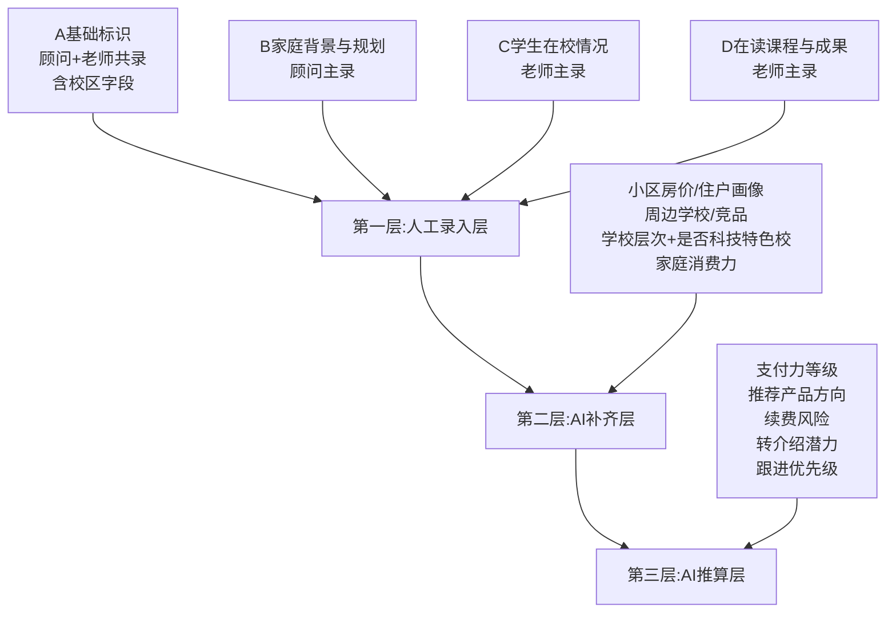
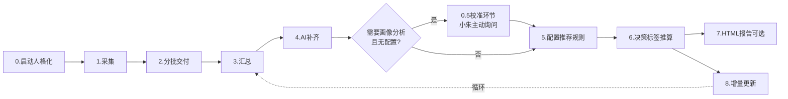

# 校区学员情况管理 Skill — 产品需求文档（PRD）

| 项 | 内容 |
|---|---|
| 文档版本 | v1.3 |
| 撰写人 | 产品经理 许清楚（Xu） |
| 日期 | 2026-06-22 |
| 产品形态 | workbuddy Skill（以 SKILL.md 为载体） |
| 目标用户 | 编程教育校区 顾问 / 老师 / 校长 |
| 开源计划 | GitHub 公开，MIT 协议 |
| 变更说明 | v1.3：校准环节触发时机调整——校长首次打开不再一上来就配置，而是先体验汇总表价值，等汇总表出来后、需要做画像分析时，小朱再主动询问是否配置。符合"先体验价值，再深入配置"的认知规律。涉及§5场景0.5、§5场景0角色化开场、§7.1交互流、§10校准环节触发条件、§10.4设计原则。v1.2：人格化形象升级——"热情小管家"升级为"校区小助手小朱"，有名字有活人感，新增角色化开场（顾问/老师/校长差异化问候）；§10 待确认事项改为"校长首次配置流程（校准环节）"——原 Q1-Q8 不再是开发前待确认问题，而是 skill 首次激活时小朱问校长的问题，生成校区配置.json（含决策标签阈值+推荐规则+报告偏好），决策标签阈值从配置读取，skill 自适配各校区。v1.1：根据大卫老师 17 条反馈 + 2 条澄清做增量更新。主要变更：采集方式改为字段引导式；多校区支持提升至 P0/P1；新增 Skill 人格化设计、分批交付+完成率、HTML 前端报告；字段框架调整（A 去电话加校区、C 学校层次移 AI 补齐含科技特色校、成绩排名改大致水平）；话术改为参考非脚本；补充目标定位（数据底座→提高转化效率）。 |

---

## 0. 原始需求复述

大卫老师与某校区校长探讨 AI 时代编程教育转型时发现：校区学员信息全靠口口相传，顾问/老师文化水平偏低、缺乏结构化思维，导致挖需不准、续费/转介绍靠感觉。本 Skill 旨在用 workbuddy 的引导式采集能力，把顾问、老师脑子里的零散信息结构化成 Excel 表，支撑精准挖需与课程推荐。同时承担"教会校区员工用 AI"的教育目的。

**核心约束**：交付物必须是 `.xlsx`（老师只会开 Excel）；唯一标识用学生中文正式名（**完整含姓**），重名用年级对齐；不能含真实学员数据（开源要求）。

### 0.1 产品定位（v1.1 新增）

> **学情管理是基础数据底座，最终目标是提高转化效率。**

转化效率的提升靠校长的推荐思路，这是 Skill 与校长**共创**的地方——规则不写死，由校长配置驱动。Skill 负责把数据底座打牢（采集→结构化→补齐→汇总→分析），校长负责把转化经验沉淀为推荐规则，两者结合才能实现"数据驱动的精准转化"。

| 层级 | 职责 | 谁负责 |
|---|---|---|
| **底座层（Skill 固化）** | 学员信息采集、结构化、AI 补齐、汇总合并、数据分析 | Skill 自动 |
| **转化层（校长共创）** | 推荐规则配置、决策标签推算、产品推荐画像 | 校长配置 + Skill 执行 |

**共创原则**：推荐规则不写死，校长配置什么 Skill 就按什么推算。转化逻辑是 Skill 和校长共创的地方。

---

## 1. 产品目标

### 1.1 双目的设计

| 目的 | 描述 | 衡量指标 |
|---|---|---|
| 目的一：学员管理 | 把顾问/老师脑子里的学员信息结构化为 Excel，支撑挖需、续费、转介绍决策 | 一位老师 50+ 学生、多老师一校区的规模，可在 **1 周内**完成全员采集与汇总 |
| 目的二：AI 教育 | 通过日常使用 Skill，让顾问/校长/老师亲身体验 AI 价值，建立 AI 使用习惯 | 采完一个学生后，用户能主动说出"AI 帮我把口述信息整理成表格了" |

### 1.2 Product Goals（3 个正交目标）

- **G1 结构化零散信息**：通过字段引导式采集，将顾问/老师的隐性知识转为可分析的表格字段
- **G2 降低使用门槛**：使用者无需懂 JSON/CSV，全程只接触 Excel + 自然语言对话
- **G3 可复制开源**：Skill 文件 + 示例配置可被任意编程教育校区下载即用

---

## 2. 三角色用户故事

### 2.1 顾问（销售）—— "我只管口述，AI 帮我整理"

> As a 顾问，I want 跟 AI 聊天一样把我知道的家长情况说出来，so that 不用填表格也能留下结构化记录。

> As a 顾问，I want 一次只采一两个学生，采完打个勾，so that 不会因为一次太多而放弃。

> As a 顾问，I want 不知道的字段可以直接说"不知道"，so that 不会被卡住。

### 2.2 老师 —— "我手上 50 个学生，得能分批管"

> As a 老师，I want 先把学生名单录进去当待办，so that 我能清楚还剩谁没采。

> As a 老师，I want 采的时候能补上学生在校情况和课程成果，so that 顾问看不到的细节我能补全。

> As a 老师，I want 采了一部分就能交给校长看进度，so that 校长不用等全部采完才知道进展。

### 2.3 校长 —— "我要看到全盘，还要能调推荐规则"

> As a 校长，I want 一键合并所有个人表，so that 我能一眼看到全校学员全貌。

> As a 校长，I want AI 联网帮我补齐小区房价、周边竞品这些信息，so that 不用我自己去查。

> As a 校长，I want 能配置"什么情况推什么课"，so that 推荐符合我们校区实际。

> As a 校长，I want 系统自动算出每个学生的支付力、续费风险、跟进优先级，so that 我能精准抓重点。

> As a 校长，I want 采了一部分就能看到完成率和百分比，so that 我能掌握采集进度、分批验收。

> As a 校长，I want 可选生成 HTML 可视化报告，so that 比 Excel 更直观地看数据分析和高净值用户画像。

---

## 3. 需求池（P0 / P1 / P2）

| 优先级 | 需求 ID | 需求描述 |
|---|---|---|
| **P0** | R01 | **Skill 人格化设计**：内置"校区小助手小朱"角色（有名字有活人感），启动打招呼→介绍用途→角色化开场（顾问/老师/校长差异化问候）→开始；完成清单给情绪价值+提醒交给校长 |
| **P0** | R02 | 三角色路由 + **多校区确认**：首次打开问"你是？"+ "您在哪个校区？"，按角色+校区进入不同模式 |
| **P0** | R02.5 | **校长配置流程（校准环节）**：校长需要做画像分析/决策标签推算时，小朱先"认识"校长——问产品列表、支付力阈值、续费风险逻辑、转介绍潜力判断、跟进优先级标准、是否需要 HTML 报告、推荐规则维度，生成 `校区配置.json`（决策标签阈值从配置读取，skill 自适配各校区）。**v1.3 调整**：校准环节不在首次打开时触发，而是等汇总表出来后、校长需要做画像分析时才触发（先体验价值，再深入配置） |
| **P0** | R03 | **采集模式（字段引导式）**：顾问录 A+B，老师录 A+C+D；给字段提示让顾问讲→AI 提取结构化→检查缺失关键字段→只追问缺失关键信息（不为追问而追问） |
| **P0** | R04 | 名单进度管理：先录名单作待办，逐个采集打勾，本地 JSON 缓存 |
| **P0** | R05 | **分批交付 + 完成率显示**：采一部分即可导出/交给校长，校长可见完成率与百分比，不必等全部采完 |
| **P0** | R06 | 采集产出 `.xlsx` 个人学员表（每个角色一份） |
| **P0** | R07 | 汇总合并：校长导入多份 Excel，按姓名（**完整含姓**，重名用年级）合并 |
| **P0** | R08 | 冲突处理 A+C 方案：同字段不同来源都保留，标注来源 + flag |
| **P0** | R09 | 交付物强制 `.xlsx`，用户不接触 JSON |
| **P0** | R10 | 口语化话术（**参考非脚本，有活人感**）+ 适度情绪价值（不用每个都教育，让老师顾问觉得做有价值的事+感受 AI 提效）；小朱全程保持自称"小朱"，拉近距离 |
| **P1** | R11 | **多校区支持**：校区字段贯穿采集/汇总/分析，跨校联校设计逻辑不冲突，先确认所在校区（v1 就做） |
| **P1** | R12 | AI 补齐层：联网检索小区房价/周边学校/竞品/**学校层次（含是否科技特色校）**，标注"AI补齐请核实"，**检索方式灵活不写死** |
| **P1** | R13 | 决策标签推算：支付力/续费风险/转介绍潜力/跟进优先级 |
| **P1** | R14 | **推荐规则配置模式（引导式）**：问更多，引导校长思考——"现在有哪些产品？推荐思路逻辑？我帮您做匹配"，写入 `校区配置.json` 的推荐规则部分 |
| **P1** | R15 | **HTML 前端报告（可选输出）**：问校长需不需要再做。三页结构——①表格呈现+筛选 ②校区分析报告 ③产品推荐画像 |
| **P1** | R16 | 增量更新：新生加入、已采学生字段变更 |
| **P2** | R17 | 推荐产品方向标签（依赖 R14 配置） |
| **P2** | R18 | 导出 PDF 简报给校长开会用 |

> **v1.1 变更摘要**：R14 多校区 P2→P1（v1 就做）；新增 R01 人格化（P0）、R05 分批交付（P0）、R15 HTML 报告（P1）；R03 采集方式改字段引导式；R10 话术改参考非脚本；R14 配置模式改引导式。
> **v1.2 变更摘要**：R01 人格化形象升级为"校区小助手小朱"（有名字有活人感，角色化开场）；新增 R02.5 首次配置流程（校准环节，P0）；§10 待确认事项改为首次配置流程。
> **v1.3 变更摘要**：校准环节触发时机调整——从"校长首次打开"改为"汇总表出来后、需要做画像分析时"；§5场景0校长角色化开场不再直接导向校准；§7.1校长首次打开直接进工作流；§10校准触发条件改为"画像分析时小朱主动询问"；新增设计原则"先体验价值，再深入配置"。

---

## 4. 字段框架 v0.4（v1.1 调整）

### 4.1 三层架构总览



### 4.2 第一层：人工录入层

| 字段组 | 字段 | 录入角色 | 必填 | 说明 |
|---|---|---|---|---|
| **A.基础标识** | 姓名 | 顾问+老师 | ✅ | **完整姓名含姓**（大名4字可能只给名不给姓，导致无法匹配） |
| | 昵称 | 顾问 | | |
| | 年级 | 顾问+老师 | ✅ | 重名对齐依据 |
| | 年龄 | 顾问+老师 | | |
| | 所在校区 | 顾问+老师 | ✅ | **v1.1 新增**，多校区支持，首次确认后可默认带入 |
| | ~~电话~~ | — | | **v1.1 移除**：不采集电话。需要时让校长导家长手机号列表 |
| **B.家庭背景与规划** | 家长职业 | 顾问 | | 只知领域或大公司名亦可 |
| | 单位性质 | 顾问 | | 国企/私企/外企/体制内 |
| | 家庭结构 | 顾问 | | 核心家庭/三代同堂等 |
| | 教育氛围 | 顾问 | | 家长辅导力度 |
| | 居住小区 | 顾问 | | AI 补齐入口 |
| | 家长规划目标 | 顾问 | | 升学/竞赛/兴趣 |
| | 对AI认知度 | 顾问 | | 高/中/低 |
| **C.学生在校情况** | 学校名称 | 老师 | | AI 补齐入口 |
| | ~~学校层次~~ | — | | **v1.1 移至 AI 补齐层**：老师/顾问不知道就说不知道，AI 联网查，含"是否科技特色校" |
| | 成绩水平 | 老师 | | **v1.1 调整**：敏感字段，愿意说就说，难说具体排名，**有大致水平即可**（前几名/中等/偏后） |
| | 性格特点 | 老师 | | |
| | 兴趣偏好 | 老师 | | |
| | 课堂表现 | 老师 | | |
| | 同伴关系 | 老师 | | |
| **D.在读课程与成果** | 已报名课程 | 老师 | | |
| | 在读课程 | 老师 | | |
| | 学习时长 | 老师 | | |
| | 作品成果 | 老师 | | |
| | 续费历史 | 老师 | | |

> **v1.1 字段调整说明**：
> - A.基础标识：去掉电话，加校区字段，姓名强调"完整含姓"
> - C.学生在校情况：学校层次移至 AI 补齐层（含是否科技特色校），成绩排名改为"大致水平即可"

### 4.3 第二层：AI 补齐层（校长汇总时联网检索）

| 补齐字段 | 数据来源 | 标注 |
|---|---|---|
| 小区房价段/住户画像 | 联网检索（居住小区） | "AI补齐，请人工核实" |
| 周边学校学情考情 | 联网检索（学校名称） | 同上 |
| **学校层次 + 是否科技特色校** | 联网检索（学校名称） | **v1.1 新增**：老师/顾问不知道就说不知道，AI 联网补齐 |
| 周边竞品机构 | 联网检索（小区/学校） | 同上 |
| 家庭消费力评估 | 综合职业+小区推算 | 同上 |
| 其他补充 | AI 综合判断 | 同上 |

> ⚠️ **注意**：只知道家长职业领域或大公司名，不知道具体工作单位，消费力评估为推断值。

#### 联网搜索指引设计（v1.1 新增）

> ⚠️ **重要原则**：Skill 里给**灵活的检索方式/方向/技巧**，不写死规则。
> 原因：不知道用户实际用的是什么模型，写死规则可能有偏差。目标是让不同模型都能合理执行检索任务。

| 维度 | 指引内容（方向性，非死规则） |
|---|---|
| **检索方向** | 围绕"居住小区""学校名称"两个锚点，检索：房价段/住户画像、周边教育资源、周边竞品机构、学校层次与特色 |
| **检索技巧** | ① 用小区名+城市名组合搜索，避免同名小区混淆；② 学校名加"科技特色/重点/普通"等关键词；③ 竞品搜索用"小区名+编程/少儿编程/STEAM"组合；④ 交叉验证多个来源，取共识值 |
| **灵活执行** | 模型根据自身能力选择检索策略：能联网就用联网，不能就基于知识库推断并标注；检索失败不阻塞流程，标"待补齐" |
| **结果标注** | 所有 AI 补齐值统一附"AI补齐，请人工核实"；学校层次特别标注"是否科技特色校" |

### 4.4 第三层：AI 推算层（决策标签，系统自动）

| 决策标签 | 推算依据 | 输出形式 |
|---|---|---|
| 支付力等级 | 职业+小区房价段+消费力 | 高/中/低 |
| 适合推荐产品方向 | 校区配置.json（推荐规则）+ 学生画像 | 课程名 |
| 续费风险 | 学习时长+课堂表现+续费历史+距上次沟通 | 高/中/低 |
| 转介绍潜力 | 家庭结构+家长规划+对AI认知度 | 高/中/低 |
| 本月跟进优先级 | 综合以上四项 | 1-5 星 |

---

## 5. 使用场景详细流程

### 场景总览



### 场景 0：Skill 人格化启动（v1.3 调整）

| 项 | 内容 |
|---|---|
| **触发** | 用户打开 Skill |
| **角色** | 校区小助手小朱（有名字有活人感） |
| **流程** | ① 打招呼（活人感："叫我小朱就行"）<br>② 确认身份（顾问/老师/校长）<br>③ **角色化开场**（确认身份后，按角色差异化介绍能力）<br>④ 确认所在校区（多校区支持）<br>⑤ 开始对应模式（校长直接进工作流，不强制校准） |
| **完成反馈** | 完成采集清单时给情绪价值（"太棒了，这批孩子的信息都齐了！"）+ 提醒交给校长（"记得把这份数据交给校长汇总哦"） |

**启动话术示例**（参考，非脚本）：
```
🤖 小朱: "嗨！我是您的校区小助手，叫我小朱就行。
   请问您是顾问、老师还是校长呀？"
👤 "我是老师"
🤖 小朱: "老师好～我能帮您把手上的学生情况整理成档案，50个学生也能轻松管。
   您在哪个校区？这样我帮您分好类。"
👤 "xx校区"
🤖 小朱: "收到～咱就开始吧。您手上有哪些学生，先报个名我列个单子。"
```

**角色化开场话术（确认身份后，v1.3 调整）**：

| 角色 | 角色化开场（参考，非脚本） |
|---|---|
| 顾问 | "顾问老师好～我能帮您把家长情况整理成清清楚楚的表格，不用填表，聊着天就录好了。" |
| 老师 | "老师好～我能帮您把手上的学生情况整理成档案，50个学生也能轻松管。" |
| 校长 | "校长好～我能帮您汇总全校学员情况。您先把老师顾问采集的表格发我就行。" → 直接进入汇总工作流（不在此处触发校准） |

> 💡 **活人感设计要点**：小朱有名字有身份，更像真人小助手；角色化开场让用户快速理解自己能做什么；拉近距离，降低使用门槛。各处话术保持"小朱"自称，避免机械感。
> 💡 **v1.3 调整**：校长开场不再导向校准环节，而是直接进入汇总工作流。校准延后到汇总表出来后、需要做画像分析时才触发（详见场景 0.5）。

### 场景 0.5：校长配置流程（校准环节，v1.3 调整触发时机）

| 项 | 内容 |
|---|---|
| **触发** | 校长汇总表出来后，需要做画像分析/决策标签推算，且检测到无 `校区配置.json` |
| **角色** | 校区小助手小朱 |
| **本质** | 先让校长看到汇总表的价值，再谈定制——校准问题有了汇总表上下文，校长回答更有针对性 |
| **流程** | ① 汇总表生成后，小朱主动询问："接下来我可以帮您做更深的分析，不过需要先了解下您校区的推荐思路，您想现在配置吗？"<br>② 校长选"现在配置" → 进入校准（详见 §10）<br>③ 校长选"先看看" → 暂不配置，校长可随时回来配置<br>④ 校准完成 → 生成 `校区配置.json`（含决策标签阈值+产品推荐规则+报告偏好）<br>⑤ 确认："了解您了，以后我就按这个帮您分析。随时能改。"<br>⑥ 进入画像分析工作流 |
| **输出** | `校区配置.json` |
| **后续修改** | 校长随时可说"改下配置"，重新进入校准流程更新配置 |

**校准触发流程示例**（参考，非脚本）：
```
（汇总表刚生成）
  ↓
🤖 小朱: "汇总表出来了，您看是不是比口口相传清楚多了？
   接下来我可以帮您做更深的分析——比如哪些家长适合推什么课、谁该重点跟进。
   不过这需要先了解下您校区的推荐思路和判断标准。
   您想现在做这个配置吗？还是先看看表格熟悉下？"
  ↓
👤 "现在配置吧"
  ↓
🤖 小朱: "好嘞，咱们聊几句就行～"
  ↓ （逐项问校准问题，详见 §10）

🤖 小朱: "了解您了！我把您说的都记好了，以后我就按这个帮您分析。
   随时能改，您想调整跟小朱说一声就行。"
  ↓
  生成 校区配置.json → 进入画像分析工作流
```

> ⚠️ **v1.3 关键调整**：校准不在首次打开时触发。校长还没看到 skill 的价值，就让他回答一堆配置问题，体验不好。应该先让校长看到学员汇总表的价值，再谈定制。校准问题有了汇总表上下文，校长回答也更有针对性。
> ⚠️ **关键设计**：校准问题每个校区不同，skill 自适配。决策标签的阈值不再"待确认占位"，而是从 `校区配置.json` 读取。

### 场景 1：学员信息采集（字段引导式）

| 项 | 内容 |
|---|---|
| **触发角色** | 顾问 / 老师 |
| **输入** | 自然语言口述 |
| **处理** | ① 先录学生名单作待办（本地 JSON 缓存）<br>② 每次选 1-2 个学生采集<br>③ **字段引导式**：给字段提示让顾问讲→AI 提取结构化→检查缺失关键字段→只追问缺失关键信息<br>④ 容忍"不知道"，跳过留空<br>⑤ 采完一个给情绪价值（不用每个都教育）<br>⑥ 打勾标记完成 |
| **输出** | `个人学员表_顾问.xlsx` 或 `个人学员表_老师.xlsx` |
| **退出条件** | 用户说"采完了"或主动退出 |

**采集工作台逻辑（字段引导式）**：
```
启动 → 小朱打招呼 → 确认身份+校区 →
  → (顾问/老师: 直接采集 / 校长: 直接进汇总工作流) →
  → 显示待办名单(未采/已采) → 选一个学生 →
  → 给字段提示（如"说说这孩子家里情况"）→
  → 顾问按字段讲 →
  → AI 提取结构化信息 →
  → AI 检查缺哪些关键字段 →
  → 只追问缺失的关键信息（不为追问而追问）→
  → 采完该生 → 情绪价值+打勾 →
  → 问"继续下一个吗?" → 是→循环 / 否→导出xlsx
```

**字段引导式 vs 逐字段追问 对比**：

| 方式 | 旧（逐字段追问） | 新（字段引导式） |
|---|---|---|
| 交互 | AI 逐个字段问，顾问逐个答 | AI 给字段提示，顾问自由讲，AI 提取 |
| 追问 | 每个字段都问 | 只追问缺失的关键字段 |
| 体验 | 像填表，机械 | 像聊天，活人感 |
| 效率 | 慢 | 快，尊重顾问表达节奏 |

### 场景 2：分批交付 + 完成率显示（v1.1 新增）

| 项 | 内容 |
|---|---|
| **触发角色** | 老师 / 顾问 → 交付给校长 |
| **输入** | 已采集的部分个人表 |
| **处理** | ① 不必等全部采完，采一部分即可导出<br>② 校长导入后可见完成率（已采/总名单）与百分比<br>③ 2-3 周内分批交付，校长逐步验收 |
| **输出** | 分批的个人学员表 + 完成率统计 |
| **价值** | 校长早看到数据早决策，不用干等；老师有阶段性成就感 |

### 场景 3：表格汇总合并

| 项 | 内容 |
|---|---|
| **触发角色** | 校长 |
| **输入** | 多份 `个人学员表_*.xlsx`（顾问的 + 各老师的，可能跨校区） |
| **处理** | ① 读取所有 Excel<br>② 按姓名合并（完整含姓，重名用年级对齐）<br>③ A 基础标识合并去重（含校区字段）<br>④ B/C/D 同字段冲突 → A+C 方案：都保留标注来源<br>⑤ 冲突信息 flag 给校长<br>⑥ 显示各校区/整体采集完成率 |
| **输出** | `合并汇总表.xlsx` + 冲突清单（单独 sheet） |
| **冲突展示** | 单元格内 `"顾问认为:xxx / 老师反馈:yyy [待核实]"` |

### 场景 4：AI 补齐字段

| 项 | 内容 |
|---|---|
| **触发角色** | 校长 |
| **输入** | `合并汇总表.xlsx` |
| **处理** | ① 提取"居住小区""学校名称"字段<br>② 联网检索小区房价段、周边学校、竞品机构、**学校层次+是否科技特色校**<br>③ 综合职业推算家庭消费力<br>④ 所有补齐值标注"AI补齐，请人工核实"<br>⑤ **检索方式灵活**，按 4.3 指引执行，不写死规则 |
| **输出** | `带补齐字段的汇总表.xlsx` |
| **降级策略** | 联网失败 → 该字段标"待补齐"，不阻塞流程 |

### 场景 5：推荐规则配置（引导式）

| 项 | 内容 |
|---|---|
| **触发角色** | 校长 |
| **输入** | 校长口述本校推荐逻辑 |
| **处理** | ① 进入配置采访模式<br>② **问更多，引导校长思考**："现在有哪些产品？""推荐思路逻辑是什么？""我帮您做匹配"<br>③ 追问条件维度（支付力/年级/兴趣/规划目标/是否科技特色校等）<br>④ 生成结构化规则<br>⑤ 规则写入 `校区配置.json` 的"推荐规则"字段 |
| **输出** | 更新 `校区配置.json`（推荐规则部分） |
| **关联** | 画像分析前首次配置时（场景 0.5，汇总表出来后触发）问一遍；后续校长可随时进入此场景修改 |

**配置示例（首次配置时小朱问校长后生成，存入校区配置.json）**：
```json
{
  "校区": "示例校区",
  "产品列表": ["AI编程进阶营", "Scratch基础", "竞赛冲刺班"],
  "决策标签阈值": {
    "支付力": {"高": "xx条件", "中": "xx条件", "低": "xx条件"},
    "续费风险": {"高": "xx条件", "中": "xx条件", "低": "xx条件"},
    "转介绍潜力": {"高": "xx条件", "中": "xx条件", "低": "xx条件"},
    "跟进优先级": "校长的排序逻辑"
  },
  "推荐规则": [
    {
      "条件": {"支付力": "高", "年级": "4-6年级", "兴趣": "含科技类", "学校科技特色": true},
      "推荐课程": "AI编程进阶营",
      "理由": "高支付力+科技兴趣+科技特色校，适合进阶产品"
    }
  ],
  "报告偏好": {"HTML报告": true, "需要哪几页": ["页1表格呈现", "页2校区分析", "页3产品推荐"]}
}
```

> 💡 **共创说明**：推荐规则是 Skill 和校长共创的地方，规则不写死。校长配置什么，Skill 就按什么推算。决策标签阈值也从配置读取，skill 自适配各校区。

### 场景 6：决策标签推算

| 项 | 内容 |
|---|---|
| **触发角色** | 校长 |
| **前置** | 需要有 `校区配置.json`。若无配置，小朱先主动询问是否进入校准（场景 0.5） |
| **输入** | `带补齐字段的汇总表.xlsx` + `校区配置.json` |
| **处理** | ① 逐学生计算 5 个决策标签<br>② 支付力/续费风险/转介绍潜力/跟进优先级 **从 `校区配置.json` 读取阈值逻辑**（不再待确认占位，每个校区不同，skill 自适配）<br>③ 推荐产品方向用配置中的推荐规则匹配<br>④ 无匹配规则 → 标"待配置" |
| **输出** | `带标签的最终汇总表.xlsx` |

### 场景 7：HTML 前端报告（可选输出，v1.1 新增）

| 项 | 内容 |
|---|---|
| **触发角色** | 校长 |
| **前置** | **问校长需不需要**，需要才生成 |
| **输入** | `带标签的最终汇总表.xlsx` |
| **输出** | 单文件 `校区分析报告.html`（三页结构） |

**三页结构**：

| 页码 | 页面 | 解决什么问题 | 内容 |
|---|---|---|---|
| 页1 | 表格呈现 + 筛选 | Excel 太长不好看 | 全学员表格，支持按校区/年级/支付力/风险等筛选排序 |
| 页2 | 校区分析报告 | 数据分析价值 | 高净值用户占比、家长来源小区分布、校区理念分析、学校层次分布等大数据分析 |
| 页3 | 产品推荐画像 | 精准转化 | 哪些家长适合推什么 + 百分比 + 画像筛选（按标签筛人群） |

> 💡 **输出双形态**：Excel 必导（看原始资料/手动摘表），HTML 可选（问校长需不需要再做）。

### 场景 8：增量更新

| 项 | 内容 |
|---|---|
| **触发角色** | 校长 |
| **输入** | 新的个人表 + 已有汇总表 |
| **处理** | ① 识别新增学生 → 追加<br>② 识别已存在学生字段变更 → 更新（变更值保留旧值标注）<br>③ 重新触发 AI 补齐 + 决策标签重算 |
| **输出** | `更新后的汇总表.xlsx` |
| **变更记录** | 单独 sheet 记录"谁/何时/改了什么" |

---

## 6. 采集话术设计（v1.1 调整）

### 6.1 设计原则

| 特点 | 说明 | 示例 |
|---|---|---|
| 口语化 | 像聊天不像填表 | "这孩子家里是干啥的呀？" 而非 "请输入家长职业" |
| **字段引导式** | 给字段提示让顾问讲，AI 提取结构化，不为追问而追问 | "说说这孩子家里情况" → 顾问自由讲 → AI 提取 |
| **追问有颗粒度** | 只追问必要重要的，不为追问而追问 | 知道小区就**不用**追问自住/租房（太私密且价值低） |
| 容忍不知道 | 不强制，"不知道"直接跳 | "这个不清楚也没事，咱跳过" |
| **话术是参考非脚本** | 不是每个学生问一模一样的话，要有活人感 | 参考话术方向，根据实际对话灵活调整 |
| **情绪价值为主** | 不用每个都教育，让老师顾问觉得做有价值的事+感受 AI 提效 | 适时点出"这就是 AI 帮您干的活"即可 |

> ⚠️ **重要**：以下话术均为**参考方向**，非逐字脚本。实际采集中应根据对话上下文灵活调整，避免机械重复，保持活人感。

### 6.2 各字段引导话术示例（参考）

#### A. 基础标识

| 字段 | 话术（参考） |
|---|---|
| 姓名 | "咱先说第一个孩子，叫什么名字？**大名全名哈**，姓啥也要说，不然重名我对不上" |
| 昵称 | "平时孩子们叫他啥？没有的话跳过也行" |
| 年级 | "现在几年级了？" |
| 年龄 | "多大了？不确定的话我按年级估一个，您改" |
| 所在校区 | "您在哪个校区？我帮您分好类" |
| ~~电话~~ | **v1.1 移除，不采集** |

> 🎓 **情绪价值点**：采完基础信息后——"好嘞，基本情况我记下了。您就说几句话，我已经给他建好个人档案了。"

#### B. 家庭背景与规划（顾问）—— 字段引导式

**引导提示**："来，说说这孩子家里情况——爸妈干啥的、住哪、对孩子有啥打算，想到啥说啥。"

| 字段 | 话术（参考，按需追问） |
|---|---|
| 家长职业 | "孩子爸妈是做什么工作的呀？知道大方向就行，比如搞 IT 的、做生意的" |
| 单位性质 | "是在私企还是体制内？或者您大概知道是哪家公司？" |
| 家庭结构 | "家里几口人一起住？爷爷奶奶在不在身边？" |
| 教育氛围 | "平时谁管孩子学习多？管得严不严？" |
| 居住小区 | "住哪个小区？这个挺重要，后面我能帮您查周边情况" |
| 家长规划目标 | "家里对他以后有啥打算？想走竞赛还是就培养兴趣？" |
| 对AI认知度 | "家长平时用不用 AI 工具？ChatGPT 啥的听过没？" |

> 🎓 **情绪价值点**（不用每次都说）：采完家庭——"您随口说的这些，我已经能帮您分析出这家庭的教育投入意愿了。等汇总的时候我还能帮您查查这个小区的情况。"

> 💡 **追问颗粒度**：知道小区就**不用**追问自住/租房（太私密且价值低）。只追问对分析有实际价值的缺失关键字段。

#### C. 学生在校情况（老师）—— 字段引导式

**引导提示**："说说这孩子在学校的情况——在哪个学校、成绩咋样、性格咋样、上课表现。"

| 字段 | 话术（参考，按需追问） |
|---|---|
| 学校名称 | "这孩子在哪个学校上学？" |
| ~~学校层次~~ | **v1.1 移至 AI 补齐**：老师不知道就说不知道，AI 联网查（含是否科技特色校） |
| 成绩水平 | "在班里大概什么水平？**不用具体名次**，前几名、中等、偏后，有个大概就行" |
| 性格特点 | "这孩子性格咋样？活泼还是内向？" |
| 兴趣偏好 | "平时喜欢捣鼓啥？有没有特别迷的？" |
| 课堂表现 | "上课怎么样？专注还是容易走神？" |
| 同伴关系 | "跟同学处得好不？有没有特别要好的？" |

> 🎓 **情绪价值点**（适时）：采完在校情况——"老师您观察得真细。这些细节您不说，顾问和校长根本不知道。现在都存档了。"

> 💡 **成绩水平说明**：敏感字段，愿意说就说，难说具体排名，有大致水平就行。不追问具体名次。

#### D. 在读课程与成果（老师）

| 字段 | 话术（参考） |
|---|---|
| 已报名课程 | "之前在咱这报过啥课？" |
| 在读课程 | "现在正上着啥课？" |
| 学习时长 | "学了多久了？大概几个月？" |
| 作品成果 | "有没有做过啥作品？比赛拿过奖没？" |
| 续费历史 | "续过费没？几次了？" |

> 🎓 **情绪价值点**（适时）：采完课程——"好嘞，这孩子的情况我全记下了。等全校都采完，校长一汇总，谁该续费、谁有转介绍潜力，一目了然。"

### 6.3 通用话术模板（参考）

| 场景 | 话术（参考） |
|---|---|
| 开始采集 | 小朱："来，咱一个一个说。您手上有哪些学生，先报个名我列个单子，然后挑顺手的先聊。" |
| 答不知道 | 小朱："没事，不清楚就跳过，回头想起来了再补。" |
| 采完一人 | 小朱："好嘞，[姓名]采完了。就这几句聊天的功夫，一份完整档案就成了。继续下一个？" |
| 全部采完 | 小朱："今天辛苦了！我给您导出个 Excel，您用表格打开就能看。**记得交给校长汇总哦**。以后有新的随时找小朱补。" |

---

## 7. UI / 交互草图

> 说明：workbuddy Skill 的"UI"即对话流。以下用文字描述对话流的关键节点，供架构师设计 SKILL.md 的流程编排。

### 7.1 人格化启动 + 角色路由 + 校区确认（v1.3 更新）

```
用户说"用学情管理skill"
  ↓
小朱: "嗨！我是您的校区小助手，叫我小朱就行。
  请问您是顾问、老师还是校长呀？"
  → [1] 顾问（销售）
  → [2] 老师
  → [3] 校长

  ↓ 确认身份后，角色化开场：
选1顾问 → 小朱: "顾问老师好～我能帮您把家长情况整理成清清楚楚的表格，
         不用填表，聊着天就录好了。"
       → 问校区 → 采集模式(录A+B)
选2老师 → 小朱: "老师好～我能帮您把手上的学生情况整理成档案，50个学生也能轻松管。"
       → 问校区 → 采集模式(录A+C+D)
选3校长 → 小朱: "校长好～我能帮您汇总全校学员情况。
         您先把老师顾问采集的表格发我就行。"
       → 问校区 → 直接进入汇总工作流（不在此处触发校准）
       → 校长选择功能：
         → [1] 汇总合并（含完成率查看）
         → [2] AI补齐字段
         → [3] 配置推荐规则（改配置）
         → [4] 增量更新
         → [5] 推算决策标签（若无校区配置.json → 小朱主动询问是否进入校准，场景0.5）
         → [6] 生成HTML报告（可选）

  ↓ 汇总表出来后，小朱主动引导（v1.3 新增）：
小朱: "汇总表出来了，您看是不是比口口相传清楚多了？
  接下来我可以帮您做更深的分析——比如哪些家长适合推什么课、谁该重点跟进。
  不过这需要先了解下您校区的推荐思路和判断标准。
  您想现在做这个配置吗？还是先看看表格熟悉下？"
  → 校长选"现在配置" → 进入场景0.5 校准
  → 校长选"先看看" → 暂不配置，之后随时能配
```

### 7.2 采集工作台（字段引导式）

```
┌─────────────────────────────────────┐
│ 学情管理 - 采集模式 [老师·xx校区]     │
├─────────────────────────────────────┤
│ 待办名单 (5人)  完成率: 1/5 (20%)    │
│  ☐ 张小明  4年级   [未采]            │
│  ☐ 李小红  5年级   [未采]            │
│  ☑ 王小刚  3年级   [已采]            │
│  ☐ ...                              │
├─────────────────────────────────────┤
│ 👤 选一个开始：张小明                 │
│                                     │
│ 🤖 小朱: 好，张小明。说说这孩子在学校  │
│    的情况——在哪个学校、成绩咋样、性格  │
│    咋样。                            │
│ 👤 "他在xx小学，成绩中等偏上，性格     │
│    活泼，上课挺专注的"                │
│ 🤖 小朱: (AI提取结构化) 收到～学校、  │
│    成绩、性格、课堂表现都记下了。      │
│    (检查缺失关键字段→只追问必要的)     │
│    平时跟同学处得怎么样？              │
│ 👤 "挺好的，有几个好朋友"             │
│ 🤖 小朱: 张小明采完了！我都整理好了。  │
│    [✅打勾] 完成率 2/5 (40%)          │
│    继续下一个？                       │
└─────────────────────────────────────┘
```

### 7.3 汇总表结构（Excel）

```
| 校区 | 姓名 | 年级 | ...B字段 | ...C字段 | ...D字段 | [冲突标注] | 学校层次(科技特色) | 小区房价段 | 周边竞品 | 支付力 | 续费风险 | 转介绍潜力 | 跟进优先级 | 推荐方向 |
|------|------|------|---------|---------|---------|-----------|------------------|----------|---------|--------|---------|-----------|-----------|---------|
|xx校区|张小明|4年级 | ...     | 顾问认为:优/老师反馈:良 [待核实] | ... | 普通校(非科技特色)(AI补齐) | 8-10万/㎡ | XX机构  | 高     | 低       | 高         | ⭐⭐⭐⭐    |AI编程营  |
```

- 校区字段：v1.1 新增，多校区汇总时区分
- 冲突字段：单格内双值 + `[待核实]`
- AI 补齐字段：值后附 `(AI补齐,请核实)`
- 学校层次：AI 补齐，含"是否科技特色校"标注
- 决策标签：独立列，颜色条件格式（红/黄/绿）

### 7.4 配置模式（引导式，v1.2 更新）

```
小朱: "咱来配推荐规则。我先了解下您校区的情况——
  现在有哪些产品？"
  → 校长列举产品
小朱: "那您平时推荐思路是什么逻辑？什么样的学生您会推什么课？"
  → 校长讲推荐经验
小朱: "明白，我帮您做匹配。我梳理下条件维度：
  支付力、年级、兴趣、规划目标、学校是否科技特色…
  您看还有没有别的要考虑的？"
  → (追问补充)
  → 更新校区配置.json（推荐规则部分）
  → 小朱: "配好了，以后系统就按这个帮您推。随时能改，您跟小朱说一声就行。"
```

> 💡 **共创原则**：问更多，引导校长思考。规则是 Skill 和校长共创的，不写死。

### 7.5 HTML 前端报告（可选，v1.1 新增）

```
校长选择"生成HTML报告"
  ↓
小朱: "好，我帮您生成一份可视化报告。包含三块：
  ① 全员表格（可筛选）
  ② 校区分析报告（高净值占比、家长来源小区分布等）
  ③ 产品推荐画像（哪些家长适合推什么）
  需要哪个都做，还是挑着来？"
  → 生成 校区分析报告.html（单文件，浏览器打开）
```

**三页设计**：

| 页 | 名称 | 核心功能 |
|---|---|---|
| 页1 | 表格呈现 | 全员表格，支持按校区/年级/支付力/风险等筛选排序（解决 Excel 太长不好看） |
| 页2 | 校区分析报告 | 高净值用户占比、家长来源小区分布、校区理念分析、学校层次分布等大数据分析 |
| 页3 | 产品推荐画像 | 哪些家长适合推什么 + 百分比 + 画像筛选（按标签筛人群，看推荐分布） |

---

## 8. 数据分析价值（v1.1 新增）

> 字段摸清后，数据底座能支撑以下分析，反哺转化决策：

| 分析维度 | 能看出什么 | 价值 |
|---|---|---|
| 高净值用户占比 | 支付力"高"的学生占比 | 决定进阶产品推不推得动 |
| 家长来源小区分布 | 学员集中在哪些小区 | 指导地推/广告投放方向 |
| 校区理念分析 | 家长规划目标分布（升学/竞赛/兴趣） | 校区定位是否清晰 |
| 学校层次分布 | 学员来自重点/普通/科技特色校的比例 | 评估生源质量、调整课程难度 |
| 续费风险分布 | 高风险学生占比 | 提前干预，降低流失 |
| 转介绍潜力分布 | 高潜力家长画像 | 精准发动转介绍 |

---

## 9. 开源发布规范

开源仓库需包含以下三个核心文件，各自职责明确：

### 9.1 三个文件各自的作用

| 文件 | 作用 | 面向谁 | 内容要点 |
|---|---|---|---|
| **SKILL.md** | Skill 主体，workbuddy 加载执行的指令 | workbuddy 平台 + AI | 触发条件、小朱人格化角色、角色化开场、角色路由+校区确认、校长配置流程（校准环节，汇总表后触发）、8 场景流程、字段定义、采集话术（参考）、输出格式规范 |
| **README.md** | 项目说明，教人怎么用 | 校区长 / 技术人员 | 项目背景、安装方式、使用教程（图文）、字段说明、FAQ、开源协议 |
| **示例配置/** | 开箱即用的样例 | 首次使用者 | `校区配置_示例.json`、`个人学员表_示例.xlsx`、`合并汇总表_示例.xlsx`、`校区分析报告_示例.html`（均用化名） |

### 9.2 开源要求

- **协议**：MIT
- **测试数据**：全部化名（张小明/李小红等），严禁真实学员信息
- **README 必含**：一键安装指引、三角色快速上手 GIF/截图、常见问题
- **SKILL.md 可读性**：架构师需保证非技术校长也能看懂流程图

### 9.3 仓库结构建议

```
campus-student-skill/
├── SKILL.md                      # Skill 主体
├── README.md                     # 使用说明
├── LICENSE                       # MIT
├── 示例配置/
│   ├── 校区配置_示例.json
│   ├── 个人学员表_顾问_示例.xlsx
│   ├── 个人学员表_老师_示例.xlsx
│   ├── 合并汇总表_示例.xlsx
│   └── 校区分析报告_示例.html
└── docs/
    ├── 字段说明.md               # v0.4 字段字典
    └── 话术设计说明.md           # 采集话术设计说明
```

---

## 10. 校长配置流程（校准环节）

> **本质**：先让校长看到汇总表的价值，再谈定制——校准问题有了汇总表上下文，校长回答更有针对性。原 v1.1 的 Q1-Q8"待确认事项"不是开发前要找校长对齐的"前置问题"，而是 **校长需要做画像分析时的"校准流程"**——小朱动态问校长，存为 `校区配置.json`。
>
> **v1.3 触发时机调整**：不在校长首次打开时触发。校长还没看到 skill 的价值，就让他回答一堆配置问题，体验不好。应该先让校长看到学员汇总表的价值，再谈定制。符合认知规律：先体验价值，再深入配置。
>
> 每个校区不同，skill 自适配。决策标签的阈值从"待确认占位"改为"从校区配置.json 读取"。

### 10.1 校准流程总览

```
校长汇总表出来后，需要做画像分析/决策标签推算
  ↓
小朱主动询问："接下来我可以帮您做更深的分析，
  不过需要先了解下您校区的推荐思路和判断标准。
  您想现在做这个配置吗？还是先看看表格熟悉下？"
  ↓
校长选"现在配置" → 进入校准
校长选"先看看"   → 暂不配置，之后随时能配
  ↓（进入校准）
小朱: "好嘞，咱们聊几句就行～"
  ↓
逐项问校准问题（Q1-Q8，每项配口语化话术）
  ↓
生成 校区配置.json（含决策标签阈值+产品推荐规则+报告偏好）
  ↓
小朱: "了解您了，以后我就按这个帮您分析。随时能改，您跟小朱说一声就行。"
  ↓
进入画像分析工作流
```

### 10.2 校准问题清单（原 Q1-Q8 转为校准时小朱问校长的问题）

| 编号 | 校准问题 | 小朱话术示例（参考，非脚本） | 存入配置字段 |
|---|---|---|---|
| Q1 | 支付力等级的判定阈值（什么算高/中/低） | 小朱："您觉得什么样的家庭算支付力高？比如住高端小区的、或者家长在体制内收入稳定的？中等和偏低您怎么分？" | `决策标签阈值.支付力` |
| Q2 | 续费风险的具体权重（学习时长 vs 课堂表现 vs 续费历史） | 小朱："续费风险这块，您觉得哪个信号最关键？是孩子学的时间长短、还是课堂表现下滑、还是之前续费不太积极？我按您觉得重要的来排。" | `决策标签阈值.续费风险` |
| Q3 | 转介绍潜力的判定逻辑 | 小朱："什么样的家长您觉得转介绍潜力大？是家庭结构里老人带得多、还是家长规划目标明确的、还是对 AI 比较认可的？" | `决策标签阈值.转介绍潜力` |
| Q4 | 跟进优先级 1-5 星的具体算法 | 小朱："跟进优先级您怎么排的？支付力、续费风险、转介绍潜力，哪个权重最大？我按您的排序逻辑来算星级。" | `决策标签阈值.跟进优先级` |
| Q5 | 推荐规则配置的维度有哪些（支付力/年级/兴趣/规划目标/是否科技特色校？还有别的？） | 小朱："您平时推荐课程，主要看哪些维度？支付力、年级、兴趣、规划目标、学校是不是科技特色校……还有别的您会考虑的吗？" | `推荐规则`（条件维度） |
| Q6 | 是否需要"距上次沟通天数"字段（续费风险依赖） | 小朱："续费风险要不要考虑'距上次沟通多久了'这个因素？如果太久没联系，是不是风险更高？" | `决策标签阈值.续费风险`（是否纳入） |
| Q7 | 产品列表（有哪些产品可推荐） | 小朱："您校区现在有哪些课程产品？报一下名字，我帮您建好产品库。" | `产品列表` |
| Q8 | HTML 报告校长是否需要？需要哪几页？ | 小朱："除了 Excel，要不要我帮您生成一份可视化报告？有三种——全员表格、校区分析、产品推荐画像，您要哪些？" | `报告偏好` |

> ⚠️ **Q7 多校区说明**：多校区是否 v1 就做已确认（v1 就做），校区字段贯穿全流程，不再是待确认项。

### 10.3 校区配置.json 结构示例

```json
{
  "校区": "示例校区",
  "产品列表": ["AI编程进阶营", "Scratch基础", "竞赛冲刺班"],
  "决策标签阈值": {
    "支付力": {
      "高": "居住高端小区 或 家长体制内/高薪职业",
      "中": "居住普通商品房小区 或 家长普通收入",
      "低": "居住回迁房/老小区 或 家长收入不稳定"
    },
    "续费风险": {
      "高": "学习时长<3个月 且 课堂表现下滑 且 续费历史0次",
      "中": "学习时长3-6个月 或 课堂表现一般",
      "低": "学习时长>6个月 且 课堂表现稳定 且 已续费1次以上"
    },
    "转介绍潜力": {
      "高": "家庭结构三代同堂 且 家长规划目标明确 且 对AI认知度高",
      "中": "满足两项",
      "低": "满足一项或以下"
    },
    "跟进优先级": "支付力权重0.4 + 续费风险权重0.3 + 转介绍潜力权重0.3，加权排序分5档"
  },
  "推荐规则": [
    {
      "条件": {"支付力": "高", "年级": "4-6年级", "兴趣": "含科技类", "学校科技特色": true},
      "推荐课程": "AI编程进阶营",
      "理由": "高支付力+科技兴趣+科技特色校，适合进阶产品"
    }
  ],
  "报告偏好": {
    "HTML报告": true,
    "需要哪几页": ["页1表格呈现", "页2校区分析", "页3产品推荐"]
  }
}
```

### 10.4 关键设计原则

1. **先体验价值，再深入配置（v1.3 新增）**：校长还没看到汇总表的价值，就让他回答配置问题，体验不好。应先让校长看到学员汇总表的价值，再谈定制。校准问题有了汇总表上下文，校长回答也更有针对性。
2. **动态校准，非写死**：每个校区配置不同，skill 自适配。决策标签阈值从配置读取，不再"待确认占位"。
3. **口语化提问**：小朱用聊天方式问，不是让校长填表。每个问题配有参考话术，实际对话中灵活调整。
4. **随时可改**：校长随时可说"改下配置"，重新进入校准流程更新 `校区配置.json`。
5. **不阻塞主流程**：校准不在首次打开时触发，而在汇总表出来后、需要做画像分析时由小朱主动询问。校长可选"先看看"暂不配置。顾问/老师完全不受影响。

---

## 11. 技术规范补充

### 11.1 技术栈

| 项 | 选择 | 理由 |
|---|---|---|
| 平台 | workbuddy Skill | 项目核心要求 |
| 载体 | SKILL.md（Markdown 指令） | workbuddy 原生 |
| 输出格式（必导） | .xlsx | 用户唯一能打开的格式 |
| 输出格式（可选） | .html | 可视化报告，浏览器打开 |
| 内部缓存 | .json（本地） | 进度管理，用户不可见 |
| 联网检索 | workbuddy 内置 WebSearch | AI 补齐层（灵活检索，不写死规则） |

### 11.2 关键约束清单

1. ✅ 交付物强制 `.xlsx`（必导），`.html` 可选
2. ✅ 唯一标识 = 中文正式名（**完整含姓**），重名用年级对齐
3. ✅ 用户不接触 JSON
4. ✅ 容忍"不知道"，不强制必填（除姓名/年级/校区）
5. ✅ 开源不含真实数据
6. ✅ 采集方式 = 字段引导式（给字段提示→AI提取→只追问缺失关键信息）
7. ✅ 话术是参考非脚本，有活人感
8. ✅ 冲突信息 A+C 双保留方案
9. ✅ 多校区 v1 就做，校区字段贯穿全流程
10. ✅ 分批交付，校长可见完成率
11. ✅ Skill 人格化（校区小助手小朱，有名字有活人感，角色化开场）
12. ✅ 联网检索方式灵活，不写死规则
13. ✅ 校长配置流程（校准环节）：汇总表出来后、需要做画像分析时触发（先体验价值，再深入配置），生成校区配置.json，决策标签阈值从配置读取，skill 自适配各校区

---

## 附录：字段-角色-场景矩阵

| 字段组 | 顾问采集 | 老师采集 | 校长汇总 | AI补齐 | 决策推算 |
|---|---|---|---|---|---|
| A.基础标识（含校区） | ✅录 | ✅录 | ✅合并 | — | — |
| B.家庭背景 | ✅录 | — | ✅合并 | — | ✅用 |
| C.在校情况 | — | ✅录 | ✅合并 | — | ✅用 |
| D.课程成果 | — | ✅录 | ✅合并 | — | ✅用 |
| 学校层次/科技特色 | — | — | — | ✅补 | ✅用 |
| 小区房价等 | — | — | — | ✅补 | ✅用 |
| 决策标签 | — | — | — | — | ✅算 |

---

## 附录：v1.3 变更记录

| 变更编号 | 变更内容 | 影响章节 |
|---|---|---|
| v1.3-1 | 校准环节触发时机调整：从"校长首次打开"改为"汇总表出来后、需要做画像分析时" | §5场景0.5、§10、R02.5 |
| v1.3-2 | 校长角色化开场不再导向校准，改为直接进入汇总工作流 | §5场景0、§7.1 |
| v1.3-3 | §7.1 交互流：校长首次打开直接进工作流，汇总表出来后小朱主动询问是否配置 | §7.1 |
| v1.3-4 | §10 校准流程总览重写：触发条件改为"画像分析时小朱主动询问"，增加"先看看"选项 | §10.1 |
| v1.3-5 | 新增设计原则"先体验价值，再深入配置" | §10.4 |
| v1.3-6 | 场景总览流程图调整：校准环节移至汇总后、画像分析前 | §5场景总览 |
| v1.3-7 | 场景6决策标签推算增加前置说明：无配置时先触发校准 | §5场景6 |
| v1.3-8 | §11.2 约束13更新：校准触发时机改为"汇总表出来后" | §11.2 |

---

## 附录：v1.2 变更记录

| 变更编号 | 变更内容 | 影响章节 |
|---|---|---|
| v1.2-1 | 人格化形象升级："热情小管家/学校小助手"→"校区小助手小朱"（有名字有活人感） | §5场景0、§7.1、§6各处话术、R01 |
| v1.2-2 | 角色化开场：顾问/老师/校长差异化问候，快速理解各自能力 | §5场景0、§7.1 |
| v1.2-3 | 新增场景0.5：校长首次配置流程（校准环节） | §5场景0.5、R02.5 |
| v1.2-4 | §10 待确认事项→校长首次配置流程（校准环节）：Q1-Q8 转为首次激活时小朱问校长的问题 | §10 |
| v1.2-5 | 决策标签阈值从"待确认占位"→"从校区配置.json 读取"，skill 自适配各校区 | §5场景6、§10、§11.2 |
| v1.2-6 | 新增校区配置.json 结构示例（含决策标签阈值+推荐规则+报告偏好） | §5场景5、§10.3 |
| v1.2-7 | 示例配置文件：推荐规则配置.json→校区配置.json | §9 |
| v1.2-8 | 各处话术统一为小朱口吻，增加活人感 | §6、§7 |

---

## 附录：v1.1 变更记录

| 反馈编号 | 变更内容 | 影响章节 |
|---|---|---|
| 反馈1 | 衡量指标：2周→1周，一位老师50+学生、多老师一校区 | §1.1 |
| 反馈2 | 采集方式改字段引导式 | §5场景1、§6 |
| 反馈3 | 新增 Skill 人格化设计（热情小管家） | §5场景0、§7.1、R01 |
| 反馈4 | 多校区 v1 就做，P2→P1，加校区字段 | §4.2、R11、§7 |
| 反馈5 | 成绩排名→大致水平即可（敏感） | §4.2 C字段、§6.2 C |
| 反馈6 | 学校层次移 AI 补齐，含是否科技特色校 | §4.2、§4.3 |
| 反馈7 | 联网搜索给灵活指引，不写死规则 | §4.3 |
| 反馈8 | 新增分批交付+完成率显示（P0） | §5场景2、R05 |
| 反馈9 | 新增数据分析价值章节 | §8 |
| 反馈10 | 新增 HTML 前端报告（可选，三页） | §5场景7、§7.5、R15 |
| 反馈11 | 追问颗粒度：只追问必要重要的 | §6.1 |
| 反馈12 | AI 教育性→情绪价值为主，不用每个都教育 | §6 |
| 反馈13 | 姓名强调完整含姓 | §4.2 A字段、§6.2 A |
| 反馈14 | 电话字段移除 | §4.2 A字段、§6.2 A |
| 反馈15 | 话术是参考非脚本，有活人感 | §6.1 |
| 反馈16 | 校长配置模式改引导式（问更多） | §5场景5、§7.4、R14 |
| 反馈17 | 新增目标定位（数据底座→提高转化效率） | §0.1 |
| 澄清1 | 采集方式澄清：字段引导式非整段口述 | §5场景1、§6 |
| 澄清2 | 联网搜索指引：灵活非死规则 | §4.3 |

---

*文档结束。后续由架构师基于本 PRD 设计 SKILL.md 结构。*
