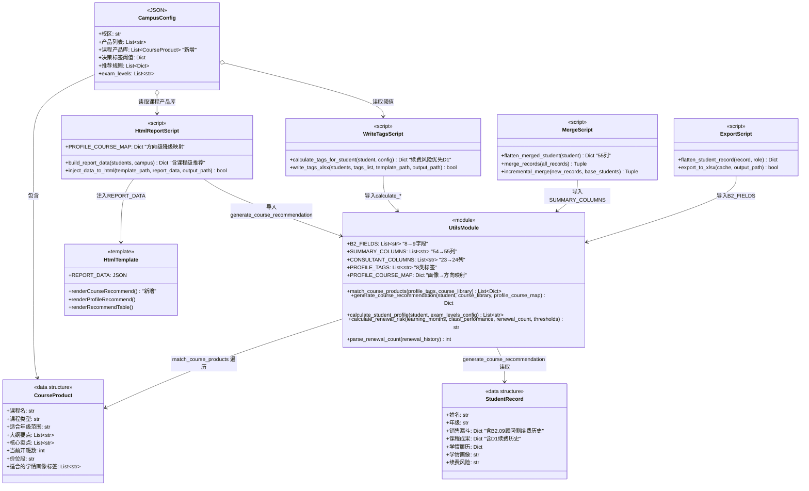
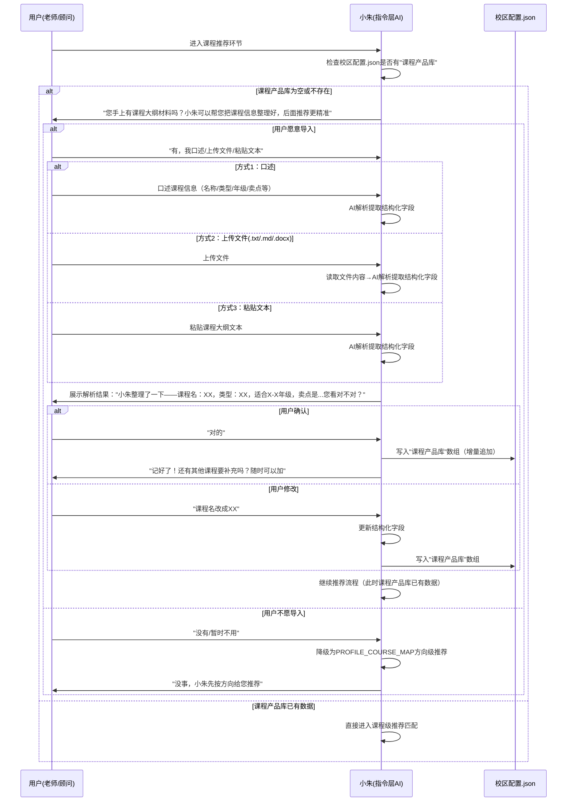
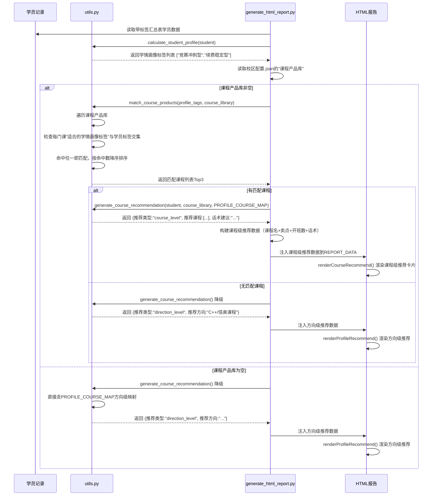
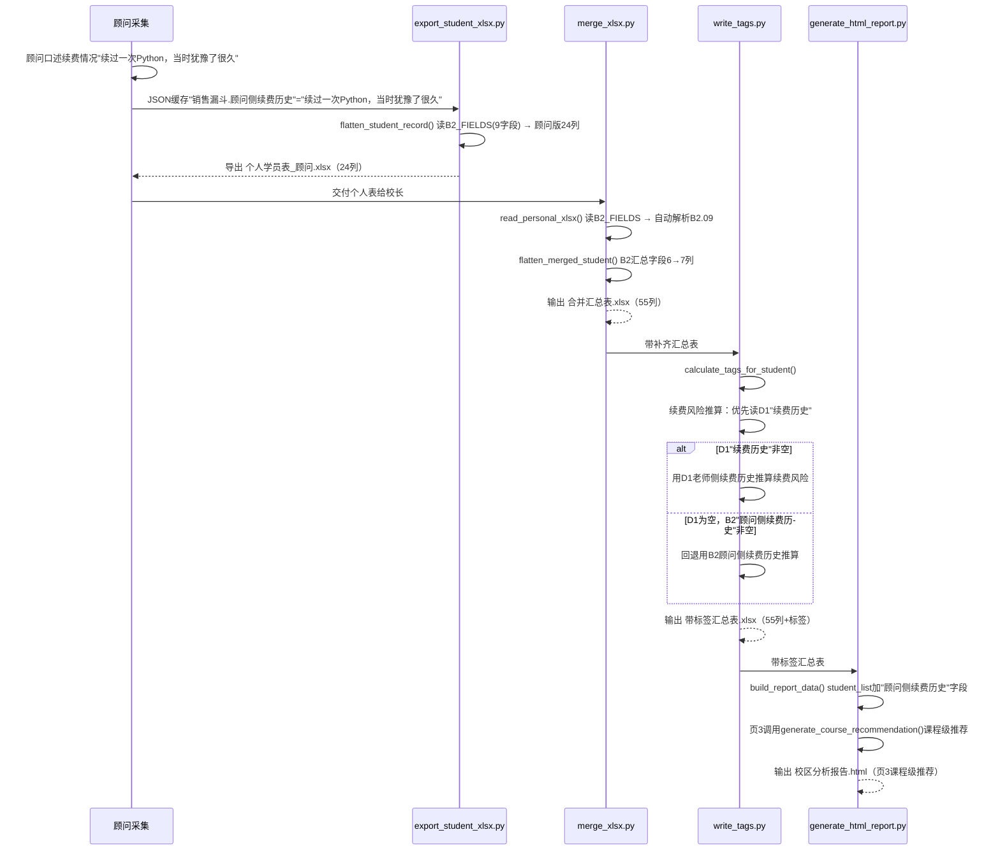
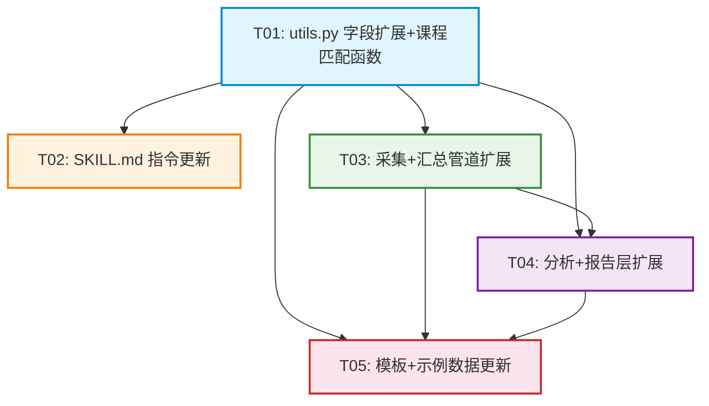

# 校区学员情况管理 Skill — v1.7.0 增量架构设计

> 架构师：高见远 | 基于增量 PRD v1.7.0（许清楚） | 2026-07-23
> 当前版本：v1.6.0 → 目标版本：v1.7.0

---

## 1. 实现方案与框架选型

### 1.1 整体技术策略

本次增量**不改变现有技术栈**（Python + openpyxl，SKILL.md 指令驱动），在现有三层架构（人工录入层 / AI补齐层 / AI推算层）基础上做两个方向的增量扩展：

| 增量方向 | 核心策略 |
|---|---|
| **课程产品库 + 推荐匹配升级** | 校区配置.json 新增"课程产品库"字段组；utils.py 新增两个匹配函数；generate_html_report.py 页3推荐模块从"方向级"升级为"课程级+方向级降级"双模式 |
| **顾问侧续费历史字段** | B2_FIELDS 8→9 字段；SUMMARY_COLUMNS 54→55 列；采集/合并/标签/报告全链路同步扩展 |

**设计原则**：
1. **向后兼容**：课程产品库为空时自动降级为现有 PROFILE_COURSE_MAP 方向级推荐，不破坏已有功能
2. **最小侵入**：字段扩展在现有分组结构内追加，不改变字段分组映射逻辑
3. **双轨保留**：B2.09 顾问侧续费历史与 D1.续费历史（老师侧）走双保留，汇总表两列并列，续费风险推算优先取 D1 老师侧

### 1.2 核心技术挑战

| 挑战 | 解决方案 |
|---|---|
| 课程产品导入流程是 SKILL.md 指令层能力（非 Python 脚本），需在不破坏现有指令流的前提下新增导入环节 | 在 SKILL.md §6 场景流程中新增"场景5.5：课程产品导入"子流程，触发时机为推荐环节前，三种导入方式（口述/上传/粘贴）由指令层 AI 处理，结构化后存入校区配置.json |
| 推荐匹配从方向级升级到课程级，需同时支持降级 | utils.py 新增 `match_course_products()` + `generate_course_recommendation()` 两个函数，generate_html_report.py 调用后者，返回结果带"推荐类型"字段区分 course_level / direction_level |
| B2.09 新增字段需穿透采集→导出→合并→标签→报告全链路 | 以 SUMMARY_COLUMNS 为单一数据源，54→55 列变更自动传导到合并/标签/报告脚本 |

### 1.3 框架与库选型

| 组件 | 选型 | 说明 |
|---|---|---|
| Python 脚本层 | Python 3.8+ | 保持不变 |
| Excel 处理 | openpyxl >= 3.1.2 | 保持不变，**无新增依赖** |
| 指令核心 | SKILL.md | 保持 §0~§10 章节结构，新增子场景和字段定义 |
| HTML 报告 | 内嵌 JS + Chart.js CDN | 页3推荐模块升级，新增课程级推荐卡片 |

---

## 2. 文件改动清单

| # | 文件 | 改动类型 | 改动内容概要 |
|---|---|---|---|
| 1 | `scripts/utils.py` | 修改 | B2_FIELDS 8→9（加"顾问侧续费历史"）；SUMMARY_COLUMNS 54→55列（B2区块"顾问复盘"后插入"顾问侧续费历史"）；CONSULTANT_COLUMNS 23→24列；新增 `match_course_products()` + `generate_course_recommendation()` 两个函数；FIELD_GROUP_MAP 自动扩展；自测用例更新 |
| 2 | `SKILL.md` | 修改 | 版本号 1.6.0→1.7.0；§4.1 B2 销售漏斗字段表加 B2.09；§4.3 续费风险推算说明加"优先 D1 老师侧"；§4.4 学情画像后新增"§4.5 课程产品库与推荐匹配升级"小节；§6 新增"场景5.5：课程产品导入"子流程 + "场景7 页3"推荐模块升级说明；§5 新增课程产品导入话术；§7.2 汇总表列数 54→55；§7.6 校区配置.json 结构加"课程产品库"字段；§10 新增注意事项 |
| 3 | `scripts/export_student_xlsx.py` | 修改 | CONSULTANT_COLUMNS 自动扩展为24列（B2多1列）；顾问版导出逻辑自动适配 |
| 4 | `scripts/merge_xlsx.py` | 修改 | `flatten_merged_student()` 中 B2 汇总字段列表 6→7（加"顾问侧续费历史"）；`read_personal_xlsx()` / `read_summary_xlsx()` / `merge_records()` / `incremental_merge()` 自动适配（B2_FIELDS 扩展传导） |
| 5 | `scripts/write_tags.py` | 修改 | `calculate_tags_for_student()` 续费风险推算逻辑：优先读 D1"续费历史"（老师侧），D1 为空时回退 B2"顾问侧续费历史"作补充参考 |
| 6 | `scripts/generate_html_report.py` | 修改 | `build_report_data()` 中页3推荐模块升级：调用 `generate_course_recommendation()`，新增课程级推荐数据结构；student_list 新增"顾问侧续费历史"字段 |
| 7 | `templates/html_report_template.html` | 修改 | 页3新增"课程级推荐"卡片区块（课程名+卖点+开班数+话术）；推荐详情表新增"推荐类型"列；渲染函数 `renderCourseRecommend()` |
| 8 | `templates/campus_config_template.json` | 修改 | 新增"课程产品库"字段，含3条示例课程产品 |
| 9 | `templates/student_template.json` | 修改 | "销售漏斗"对象新增"顾问侧续费历史"字段（空字符串） |
| 10 | `示例配置/校区配置_示范校区.json` | 修改 | 新增"课程产品库"字段，含5-6条示范课程产品数据 |
| 11 | `示例配置/采集缓存_顾问_示例.json` | 修改 | 每条记录的"销售漏斗"对象新增"顾问侧续费历史"字段示例数据 |
| 12 | `示例配置/采集缓存_老师_示例.json` | 修改 | 确认 D1"续费历史"字段已有，无需改动结构（仅确认一致性） |
| 13 | `示例配置/合并汇总表_示范校区.xlsx` | 重新生成 | 55列（B2区块+1列顾问侧续费历史） |
| 14 | `示例配置/带标签汇总表_示范校区.xlsx` | 重新生成 | 55列 + 课程级推荐数据 |
| 15 | `示例配置/校区分析报告_示范校区.html` | 重新生成 | 页3课程级推荐展示 |

---

## 3. 数据结构与接口

### 3.1 utils.py 字段扩展

#### B2_FIELDS 扩展（8→9）

```python
B2_FIELDS: List[str] = [
    "客户来源",       # B2.01
    "对接次数",       # B2.02
    "累计跟进时长",   # B2.03
    "当前阶段",       # B2.04
    "最初兴趣点",     # B2.05
    "介绍过的产品",   # B2.06
    "堵点",           # B2.07
    "顾问复盘",       # B2.08
    "顾问侧续费历史", # B2.09 新增：顾问视角的续费情况
]
```

#### SUMMARY_COLUMNS 扩展（54→55列）

在 B2 区块"顾问复盘"之后、"学校名称"之前插入"顾问侧续费历史"：

```python
# B2销售漏斗（7列进汇总；最初兴趣点/介绍过的产品不进汇总）
"客户来源", "对接次数", "累计跟进时长", "当前阶段", "堵点", "顾问复盘",
"顾问侧续费历史",  # ← 新增，B2.09
```

#### CONSULTANT_COLUMNS 扩展（23→24列）

```python
# 顾问版Excel列顺序（A + B + B2 + E）= 5+9+9+1 = 24列
CONSULTANT_COLUMNS: List[str] = A_FIELDS + B_FIELDS + B2_FIELDS + E_FIELDS
```

> 注：CONSULTANT_COLUMNS 由 `A_FIELDS + B_FIELDS + B2_FIELDS + E_FIELDS` 拼接，B2_FIELDS 扩展后自动从23列变为24列，无需手动修改。

### 3.2 校区配置.json 扩展

```json
{
  "$schema": "campus_config_v1",
  "校区": "浦东示范校区",
  "产品列表": ["AI编程进阶营", "Scratch基础", "..."],
  "课程产品库": [
    {
      "课程名": "C++信奥冲刺班",
      "课程类型": "信奥",
      "适合年级范围": "4-6年级",
      "大纲要点": ["C++基础语法", "数据结构入门", "CSP-J真题训练", "模拟赛实战"],
      "核心卖点": ["竞赛获奖含金量高", "小升初简历加分", "资深竞赛教练授课"],
      "当前开班数": 2,
      "价位段": "中高",
      "适合的学情画像标签": ["竞赛冲刺型", "科创潜力型"]
    },
    {
      "课程名": "机器人创客营",
      "课程类型": "机器人",
      "适合年级范围": "2-4年级",
      "大纲要点": ["机器人结构搭建", "图形化编程控制", "传感器应用", "项目展示"],
      "核心卖点": ["动手实践为主", "培养工程思维", "参加机器人等级考"],
      "当前开班数": 3,
      "价位段": "中",
      "适合的学情画像标签": ["兴趣探索型", "科创潜力型", "基础夯实型"]
    }
  ],
  "exam_levels": ["..."],
  "决策标签阈值": {"...": "..."},
  "推荐规则": ["..."],
  "报告偏好": {"...": "..."}
}
```

**课程产品数据结构定义**：

```python
# 单个课程产品的数据结构（Dict）
CourseProduct = {
    "课程名": str,              # 必填
    "课程类型": str,            # Python/科创/信奥/机器人/研学/VEX等
    "适合年级范围": str,        # 必填，如"4-6年级"
    "大纲要点": List[str],      # 3-5个
    "核心卖点": List[str],      # 3-5个
    "当前开班数": int,          # 整数
    "价位段": str,              # 选填，如"中高"
    "适合的学情画像标签": List[str],  # 多选，从PROFILE_TAGS 8类中选，必填
}
```

### 3.3 utils.py 新增函数

#### `match_course_products()`

```python
def match_course_products(profile_tags: List[str],
                          course_library: List[Dict[str, Any]]) -> List[Dict[str, Any]]:
    """根据学情画像标签匹配课程产品库，返回匹配的课程列表。

    匹配规则：
    - 遍历课程产品库，检查每门课的"适合的学情画像标签"字段
    - 学员画像标签命中课程标签列表中的任一，即视为匹配
    - 多门课程匹配时，按命中标签数排序（命中越多优先级越高）
    - 返回Top 3门课程

    Args:
        profile_tags: 学员学情画像标签列表，如["竞赛冲刺型", "续费稳定型"]
        course_library: 课程产品库列表，每项含"适合的学情画像标签"字段

    Returns:
        匹配的课程列表（按适合度降序排序），每项含：
        - 课程名: str
        - 核心卖点: List[str]
        - 当前开班数: int
        - 匹配标签: List[str]（命中的标签列表）
        - 命中数: int（命中标签数，用于排序）
        无匹配返回空列表
    """
```

**匹配算法伪代码**：
```
results = []
for course in course_library:
    course_tags = course.get("适合的学情画像标签", [])
    matched_tags = [t for t in profile_tags if t in course_tags]
    if matched_tags:
        results.append({
            "课程名": course["课程名"],
            "核心卖点": course.get("核心卖点", []),
            "当前开班数": course.get("当前开班数", 0),
            "价位段": course.get("价位段", ""),
            "匹配标签": matched_tags,
            "命中数": len(matched_tags),
        })
# 按命中数降序排序，取Top 3
results.sort(key=lambda x: x["命中数"], reverse=True)
return results[:3]
```

#### `generate_course_recommendation()`

```python
def generate_course_recommendation(student: Dict[str, Any],
                                   course_library: List[Dict[str, Any]],
                                   profile_course_map: Dict[str, str]) -> Dict[str, Any]:
    """生成课程推荐（升级版，支持课程级和方向级降级）。

    逻辑：
    1. 调用 calculate_student_profile 获取学情画像标签
    2. 调用 match_course_products 匹配课程产品库
    3. 有匹配 → 返回课程级推荐（课程名+卖点+开班数+话术）
    4. 无匹配/课程库为空 → 降级为 PROFILE_COURSE_MAP 方向级推荐

    Args:
        student: 学员记录（含所有汇总表字段）
        course_library: 课程产品库列表
        profile_course_map: 画像→方向映射（降级用），即 PROFILE_COURSE_MAP

    Returns:
        课程级推荐：
        {
            "推荐类型": "course_level",
            "推荐课程": [
                {"课程名": "...", "核心卖点": [...], "当前开班数": N,
                 "匹配标签": [...], "价位段": "..."},
                ...
            ],
            "话术建议": "基于匹配标签生成的推荐话术"
        }

        方向级推荐（降级）：
        {
            "推荐类型": "direction_level",
            "推荐方向": "C++/信奥课程",
            "话术建议": ""
        }
    """
```

**话术建议生成逻辑**：
- 课程级：`"该学员画像为「{标签}」，推荐「{课程名}」，当前{开班数}个班在招。核心卖点：{卖点1}、{卖点2}。"`
- 方向级：不生成话术（保持现有行为）

### 3.4 write_tags.py 续费风险推算逻辑修改

```python
# calculate_tags_for_student() 中续费风险推算部分修改：

# 续费风险：优先取 D1 老师侧"续费历史"，为空时回退 B2"顾问侧续费历史"
d1_renewal = (student.get("续费历史", "") or "").strip()       # D1 老师侧
b2_renewal = (student.get("顾问侧续费历史", "") or "").strip()  # B2 顾问侧

# 优先用 D1 老师侧续费历史
renewal_history = d1_renewal if d1_renewal else b2_renewal
renewal_count = parse_renewal_count(renewal_history)

# 学习时长优先用 D2 在读时长，回退 D1 学习时长
learning_duration = (student.get("在读时长", "") or "").strip()
if not learning_duration:
    learning_duration = (student.get("学习时长", "") or "").strip()
learning_months = parse_learning_months(learning_duration)

risk = calculate_renewal_risk(learning_months, class_performance,
                               renewal_count, risk_thresholds)
```

### 3.5 generate_html_report.py 页3数据结构扩展

```python
# build_report_data() 新增课程级推荐数据

# 页3新增：课程级推荐分组
course_recommend_groups = []
for s in students:
    profile_text = (s.get("学情画像", "") or "").strip()
    if not profile_text:
        continue
    profile_tags = [t.strip() for t in profile_text.split("、") if t.strip()]

    # 调用课程级推荐
    recommendation = generate_course_recommendation(
        s, course_library, PROFILE_COURSE_MAP
    )

    if recommendation["推荐类型"] == "course_level":
        for course in recommendation["推荐课程"]:
            course_recommend_groups.append({
                "姓名": s.get("姓名", ""),
                "学情画像": profile_text,
                "推荐类型": "课程级",
                "推荐课程": course["课程名"],
                "核心卖点": "、".join(course.get("核心卖点", [])),
                "当前开班数": course.get("当前开班数", 0),
                "匹配标签": "、".join(course.get("匹配标签", [])),
                "话术建议": recommendation.get("话术建议", ""),
            })
    else:
        course_recommend_groups.append({
            "姓名": s.get("姓名", ""),
            "学情画像": profile_text,
            "推荐类型": "方向级",
            "推荐课程": recommendation.get("推荐方向", "待配置"),
            "核心卖点": "",
            "当前开班数": 0,
            "匹配标签": "",
            "话术建议": "",
        })
```

### 3.6 类图



---

## 4. 程序调用流程（时序图）

### 4.1 课程产品导入流程



### 4.2 推荐匹配升级流程



### 4.3 B2.09 字段全链路穿透流程



---

## 5. 任务列表（有序、含依赖关系）

### T01: utils.py 字段扩展 + 新增课程匹配函数

- **任务名**：基础数据层扩展（字段定义 + 课程匹配函数）
- **源文件**：`scripts/utils.py`
- **依赖**：无（基础层，所有后续任务依赖此项）
- **优先级**：P0
- **实现要点**：
  1. B2_FIELDS 追加 `"顾问侧续费历史"`（第9个元素）
  2. SUMMARY_COLUMNS 在 `"顾问复盘"` 后插入 `"顾问侧续费历史"`（55列）
  3. CONSULTANT_COLUMNS 自动扩展（`A_FIELDS + B_FIELDS + B2_FIELDS + E_FIELDS` = 24列）
  4. 新增 `match_course_products(profile_tags, course_library)` 函数
  5. 新增 `generate_course_recommendation(student, course_library, profile_course_map)` 函数
  6. 更新 `__main__` 自测：SUMMARY_COLUMNS 断言 54→55，CONSULTANT_COLUMNS 断言 23→24，B2_FIELDS 断言 8→9
  7. 新增 `match_course_products` 和 `generate_course_recommendation` 的自测用例
- **验收标准**：
  - `python scripts/utils.py` 自测全部通过
  - `len(SUMMARY_COLUMNS) == 55`
  - `len(CONSULTANT_COLUMNS) == 24`
  - `len(B2_FIELDS) == 9`
  - `match_course_products(["竞赛冲刺型"], [{"课程名":"test","适合的学情画像标签":["竞赛冲刺型"]}])` 返回非空列表
  - `generate_course_recommendation` 课程库为空时返回 `direction_level`

### T02: SKILL.md 指令更新

- **任务名**：SKILL.md 指令核心更新（课程产品导入流程 + B2.09 字段 + 推荐逻辑升级）
- **源文件**：`SKILL.md`
- **依赖**：T01（需确认字段名和函数签名）
- **优先级**：P0
- **实现要点**：
  1. 头部 version 1.6.0 → 1.7.0，description 追加"课程产品库管理"
  2. §0 元信息表版本号更新
  3. §4.1 B2 销售漏斗字段表追加 B2.09"顾问侧续费历史"行
  4. §4.3 决策标签续费风险推算说明追加"优先取 D1 老师侧续费历史，B2 顾问侧续费历史作补充参考"
  5. §4.4 学情画像后新增 §4.5"课程产品库与推荐匹配升级"小节（含课程产品数据结构、匹配规则、降级逻辑）
  6. §5 采集话术新增"课程产品导入话术"小节（口述/上传/粘贴三种方式引导话术 + 不愿导入的降级话术）
  7. §6 场景流程新增"场景5.5：课程产品导入"子流程（触发时机/三种导入方式/解析确认/增量补充/不阻塞降级）
  8. §6 场景7 页3说明更新：推荐模块支持课程级+方向级双模式
  9. §7.2 汇总表列数 54→55，列清单追加"顾问侧续费历史"
  10. §7.6 校区配置.json 结构示例新增"课程产品库"字段
  11. §10 注意事项新增：课程产品库按校区独立配置、推荐匹配课程级优先方向级降级、B2.09与D1续费历史双保留
- **验收标准**：
  - 版本号一致更新为 1.7.0
  - B2.09 字段定义完整（类型/必填/录入角色/说明）
  - 场景5.5 流程完整（触发→询问→导入→解析→确认→存储→降级）
  - 推荐匹配升级逻辑描述清晰（课程级 → 方向级降级）

### T03: 采集 + 汇总管道扩展

- **任务名**：采集端 + 合并端 55列适配（export + merge 加 B2.09）
- **源文件**：`scripts/export_student_xlsx.py`、`scripts/merge_xlsx.py`
- **依赖**：T01（需 B2_FIELDS 扩展和 SUMMARY_COLUMNS 55列）
- **优先级**：P0
- **实现要点**：
  1. `export_student_xlsx.py`：`flatten_student_record()` 中 `for f in B2_FIELDS` 循环自动适配9字段，顾问版导出24列（无需手动改代码，但需验证）
  2. `merge_xlsx.py`：`flatten_merged_student()` 中 B2 汇总字段列表从 6 列扩展为 7 列：
     ```python
     b2_summary_fields = ["客户来源", "对接次数", "累计跟进时长", "当前阶段", "堵点", "顾问复盘", "顾问侧续费历史"]
     ```
  3. `merge_xlsx.py`：`read_personal_xlsx()` / `read_summary_xlsx()` 中 `for f in B2_FIELDS` 循环自动适配9字段
  4. `merge_xlsx.py`：`merge_records()` / `incremental_merge()` 中 B2 冲突检测和变更检测自动适配（遍历 B2_FIELDS）
  5. 验证全量合并和增量更新两种模式都能正确处理 B2.09 字段
- **验收标准**：
  - 顾问版导出 xlsx 为 24 列，含"顾问侧续费历史"列
  - 合并汇总表 xlsx 为 55 列，B2 区块含"顾问侧续费历史"列
  - 增量更新能正确检测 B2.09 字段变更
  - 冲突检测能正确处理 B2.09 顾问/老师侧冲突（双保留）

### T04: 分析 + 报告层扩展

- **任务名**：决策标签推算优化 + HTML报告课程级推荐
- **源文件**：`scripts/write_tags.py`、`scripts/generate_html_report.py`、`templates/html_report_template.html`
- **依赖**：T01（需 `generate_course_recommendation` 函数）、T03（需55列汇总表）
- **优先级**：P0
- **实现要点**：
  1. `write_tags.py`：`calculate_tags_for_student()` 续费风险推算修改——优先读 D1"续费历史"，为空回退 B2"顾问侧续费历史"
  2. `write_tags.py`：学习时长优先用 D2"在读时长"，回退 D1"学习时长"（与现有逻辑一致，确认即可）
  3. `generate_html_report.py`：`build_report_data()` 新增读取校区配置.json的"课程产品库"字段
  4. `generate_html_report.py`：`build_report_data()` 中页3推荐模块调用 `generate_course_recommendation()`，构建课程级推荐数据
  5. `generate_html_report.py`：`student_list` 新增"顾问侧续费历史"字段
  6. `generate_html_report.py`：报告数据 `统计` 新增"课程级推荐"数据结构
  7. `html_report_template.html`：页3新增"课程级推荐"卡片区块（课程名+卖点+开班数+话术建议）
  8. `html_report_template.html`：新增 `renderCourseRecommend()` 渲染函数
  9. `html_report_template.html`：推荐详情表新增"推荐类型"列（课程级/方向级）
- **验收标准**：
  - write_tags.py 续费风险推算优先用 D1，D1 为空回退 B2
  - HTML 报告页3在有课程产品库数据时展示课程级推荐（课程名+卖点+开班数+话术）
  - HTML 报告页3在课程产品库为空时降级展示方向级推荐（与现有行为一致）
  - 推荐详情表正确区分"课程级"和"方向级"推荐类型

### T05: 模板 + 示例数据更新

- **任务名**：模板文件 + 示例配置数据更新 + 重新生成示例产出物
- **源文件**：`templates/campus_config_template.json`、`templates/student_template.json`、`示例配置/校区配置_示范校区.json`、`示例配置/采集缓存_顾问_示例.json`、`示例配置/采集缓存_老师_示例.json`、`示例配置/合并汇总表_示范校区.xlsx`（重新生成）、`示例配置/带标签汇总表_示范校区.xlsx`（重新生成）、`示例配置/校区分析报告_示范校区.html`（重新生成）
- **依赖**：T01（字段扩展）、T03（管道扩展）、T04（报告层扩展）
- **优先级**：P1
- **实现要点**：
  1. `campus_config_template.json`：新增"课程产品库"字段，含3条示例课程产品（信奥/机器人/Scratch入门各1条）
  2. `student_template.json`：每条记录的"销售漏斗"对象新增"顾问侧续费历史"字段
  3. `校区配置_示范校区.json`：新增"课程产品库"字段，含5-6条示范课程产品数据（覆盖不同类型/年级/标签）
  4. `采集缓存_顾问_示例.json`：每条已采集记录的"销售漏斗"对象新增"顾问侧续费历史"字段示例值
  5. `采集缓存_老师_示例.json`：确认 D1"续费历史"字段已有（无需改结构），可在部分记录中补充续费历史数据
  6. 用更新后的脚本重新生成3个示例产出物：
     - `合并汇总表_示范校区.xlsx`（55列）
     - `带标签汇总表_示范校区.xlsx`（55列+标签+课程级推荐）
     - `校区分析报告_示范校区.html`（页3课程级推荐）
- **验收标准**：
  - campus_config_template.json 含"课程产品库"字段且 JSON 格式合法
  - student_template.json "销售漏斗"含9个字段（含"顾问侧续费历史"）
  - 示范校区配置含5-6条课程产品，每条含全部必填字段
  - 重新生成的 xlsx 为55列，HTML 报告页3展示课程级推荐

---

## 6. 依赖包列表

| 包名 | 版本 | 用途 | 本次是否有变化 |
|---|---|---|---|
| openpyxl | >= 3.1.2 | Python Excel 读写 | 否（无新增依赖） |

> **结论**：本次增量**无新增第三方依赖**。课程产品导入流程的文件解析（.txt/.md/.docx）由 SKILL.md 指令层 AI 直接处理（读取文件内容→AI理解提取），不需要 Python 端新增 docx 解析库。

---

## 7. 共享知识（跨文件约定）

### 7.1 字段扩展传导规则

- **B2_FIELDS 是 B2 字段的单一数据源**：所有脚本通过 `from utils import B2_FIELDS` 引用，B2_FIELDS 扩展后自动传导到采集/导出/合并/标签全链路
- **SUMMARY_COLUMNS 是汇总表的单一数据源**：列数变更通过 `len(SUMMARY_COLUMNS)` 自动传导
- **CONSULTANT_COLUMNS = A_FIELDS + B_FIELDS + B2_FIELDS + E_FIELDS**：拼接生成，B2 扩展后自动从23列变24列

### 7.2 B2.09 与 D1 续费历史的关系

- **B2.09 顾问侧续费历史**：顾问视角，记录顾问观察到的续费情况（有没有续费过、续过什么课、续费时的表现）
- **D1.续费历史**：老师视角，记录老师侧了解的续费次数
- **汇总表**：两列并列保留，不做强制合并（与现有 A+C 双保留策略一致）
- **续费风险推算**：优先取 D1 老师侧，D1 为空时回退 B2 顾问侧作补充参考
- **冲突处理**：两列值不同时不做冲突检测（各自独立列，不存在同字段冲突）

### 7.3 课程产品库匹配约定

- **课程产品库按校区独立配置**：每个校区的校区配置.json 有自己的课程产品库，不跨校区共享
- **支持随时增量补充**：用户可以在任何时候新增课程产品到课程产品库，不阻塞推荐流程
- **匹配规则**：学员画像标签命中课程"适合的学情画像标签"中的任一即匹配，多门匹配按命中数排序取Top3
- **降级规则**：课程产品库为空或无匹配时，自动降级为 PROFILE_COURSE_MAP 方向级推荐
- **推荐类型标识**：所有推荐结果带"推荐类型"字段（`course_level` / `direction_level`），下游统一处理

### 7.4 SKILL.md 指令层 vs Python 脚本层职责边界

| 能力 | 实现层 | 说明 |
|---|---|---|
| 课程产品导入流程（口述/上传/粘贴→解析→确认→存储） | SKILL.md 指令层 AI | AI直接理解自然语言/文件内容，提取结构化字段，存入校区配置.json |
| 课程产品匹配计算 | Python 脚本层（utils.py） | `match_course_products()` + `generate_course_recommendation()` |
| B2.09 字段采集引导 | SKILL.md 指令层 AI | 顾问采集B2销售漏斗时引导口述续费历史 |
| 续费风险推算（优先D1） | Python 脚本层（write_tags.py） | `calculate_tags_for_student()` 中修改逻辑 |
| HTML报告课程级推荐渲染 | Python 脚本 + HTML模板 | generate_html_report.py 构建数据，html_report_template.html 渲染 |

---

## 8. 待明确事项

| # | 待明确事项 | 当前假设 | 影响范围 |
|---|---|---|---|
| 1 | 课程产品导入时 .docx 文件的解析方式 | 假设由指令层 AI 直接读取文件内容（workbuddy 的 Read 工具支持 .docx），无需 Python 端新增 python-docx 依赖 | SKILL.md 场景5.5 描述 |
| 2 | 课程产品库中"适合年级范围"与学员年级的匹配是否需要参与推荐筛选 | 当前假设仅按学情画像标签匹配，年级范围仅作展示参考不参与筛选逻辑（保持简单） | `match_course_products()` 实现 |
| 3 | 课程级推荐在 write_tags.py 中是否也要写入汇总表"推荐产品方向"列 | 当前假设 write_tags.py 保持现有方向级推荐写入逻辑不变，课程级推荐仅在 generate_html_report.py 报告层展示 | write_tags.py 不改动推荐逻辑 |
| 4 | 多门课程命中数相同时的排序规则 | 当前假设命中数相同时按课程产品库中的原始顺序排列（稳定排序） | `match_course_products()` 实现 |
| 5 | 话术建议的语言风格 | 当前假设为简洁客观的推荐话术（"该学员画像为XX，推荐XX课程，当前N个班在招"），不按家长教育取向定制（与现有推荐话术素材区分） | `generate_course_recommendation()` 话术生成 |

---

## 9. 任务依赖图



**关键路径**：T01 → T03 → T04 → T05（最长依赖链，4层）

**并行机会**：T02 可与 T03/T04 并行（仅依赖 T01 的字段名和函数签名确认）

---

## 10. LINEAR 文件变更总结

| 文件 | T01 | T02 | T03 | T04 | T05 |
|---|---|---|---|---|---|
| scripts/utils.py | ✅ 修改 | | | | |
| SKILL.md | | ✅ 修改 | | | |
| scripts/export_student_xlsx.py | | | ✅ 验证 | | |
| scripts/merge_xlsx.py | | | ✅ 修改 | | |
| scripts/write_tags.py | | | | ✅ 修改 | |
| scripts/generate_html_report.py | | | | ✅ 修改 | |
| templates/html_report_template.html | | | | ✅ 修改 | |
| templates/campus_config_template.json | | | | | ✅ 修改 |
| templates/student_template.json | | | | | ✅ 修改 |
| 示例配置/校区配置_示范校区.json | | | | | ✅ 修改 |
| 示例配置/采集缓存_顾问_示例.json | | | | | ✅ 修改 |
| 示例配置/采集缓存_老师_示例.json | | | | | ✅ 确认 |
| 示例配置/合并汇总表_示范校区.xlsx | | | | | ✅ 重新生成 |
| 示例配置/带标签汇总表_示范校区.xlsx | | | | | ✅ 重新生成 |
| 示例配置/校区分析报告_示范校区.html | | | | | ✅ 重新生成 |

---

*架构设计结束。工程师请按 T01→T03→T04→T05 为主路径实施，T02 可并行。*
